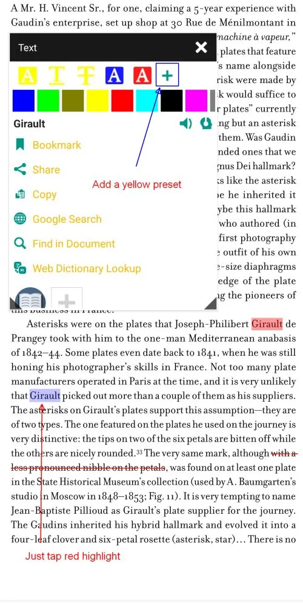
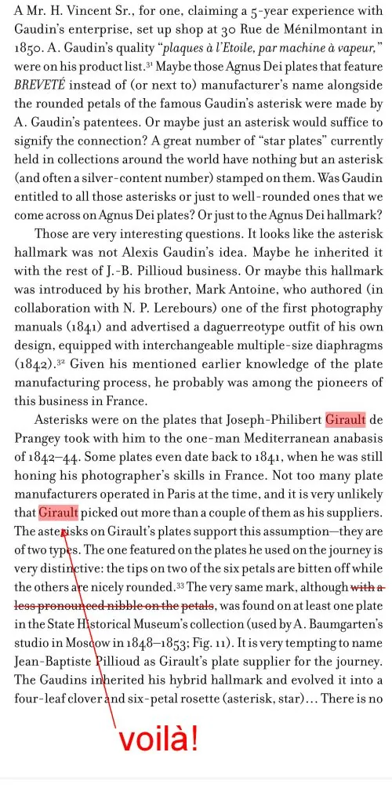
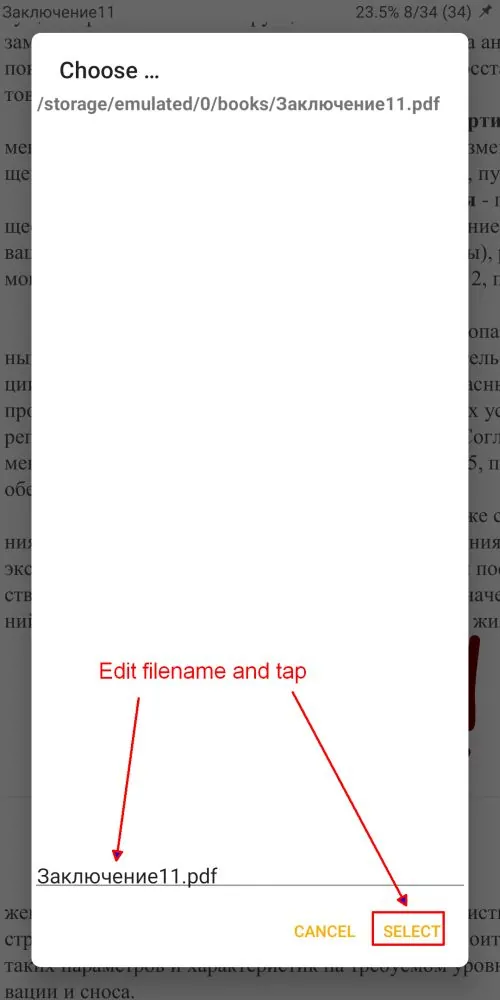
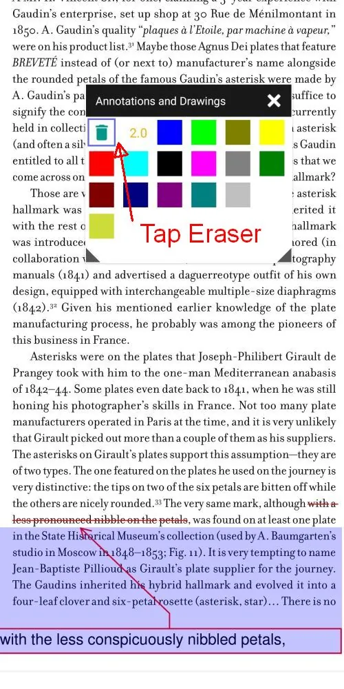
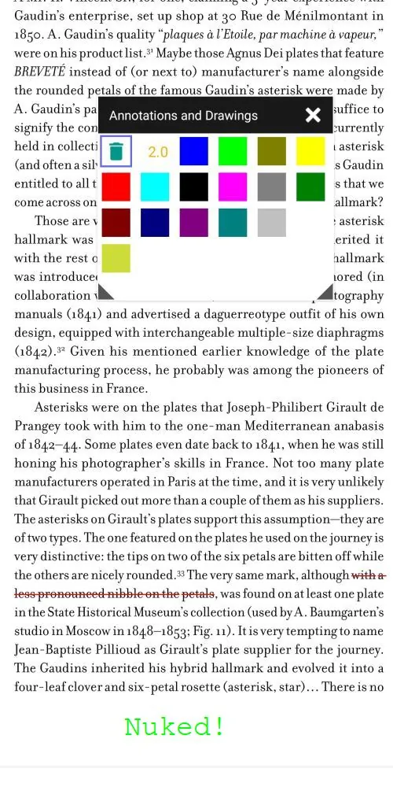

# Annotation et dessin dans des fichiers PDF

> _Librera_ prend en charge les outils d'annotation et de balisage de dessin de base dans les documents PDF.

> NB ! **Ces outils fonctionnent uniquement en mode SCROLL**

Pour rendre un document PDF adapté au dessin et/ou à l'annotation, l'utilisateur doit passer en mode défilement.
Cela révélera l'icône _Modifier_ dans le menu du bas.

## Fichiers PDF sans calque de texte
- Notes manuscrites
- Dessins à main levée (un stylet est fortement recommandé)
- Effacer le texte, les images, les informations de carte de crédit, etc.
- Effacer les marquages précédents
> Astuce : Verrouillez le « cadenas » en bas à droite pour éviter les mouvements latéraux !

||||
|-|-|-|
||||

## Fichiers PDF avec un calque de texte
En plus des marquages ci-dessus :
- Surlignage du texte
- Souligner
- Frapper à travers
> Astuce : Sélectionnez simplement un mot (avec un appui long) pour ouvrir la boîte à outils

|||
|-|-|
|||

## Marquage avec des outils prédéfinis
Le signe **+** permet à l'utilisateur d'ajouter à la liste des outils un seul des trois dans la couleur actuellement choisie.
Cela crée un outil prédéfini avec lequel vous pouvez rapidement indiquer les mots et les séquences de mots liés les uns aux autres ou méritant votre attention particulière (comme le nom _Girault_ dans l'exemple ci-dessous)

|||
|-|-|
|||

## Enregistrement des fichiers modifiés
* Un geste _Fermer_ ouvrira la fenêtre _Enregistrer les modifications ?_
* Vous pouvez enregistrer votre fichier modifié en appuyant sur _OUI_
* Vous pouvez enregistrer les modifications dans un nouveau fichier renommé. Appuyez sur _RENAME_
* Modifiez le nom du fichier en bas de la fenêtre _Choisir_ et appuyez sur _SELECT_

|||
|-|-|
|||

> Remarque : la gomme de la palette _Annotations et dessins_ peut être utilisée pour supprimer les dessins laissés par d'autres applications.

> Vous pouvez invoquer la palette en :
- Taper sur un marquage
- Appuyez sur l'icône _Modifier_ dans le menu du bas

> Sélectionnez la _Gomme_ (poubelle) en appuyant dessus, puis appuyez sur les marquages que vous êtes sur le point de supprimer.

|||
|-|-|
|||
