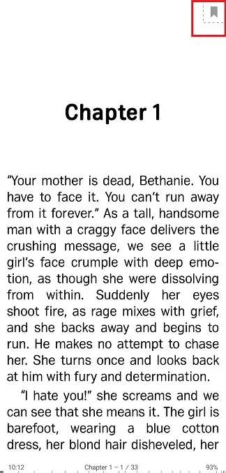
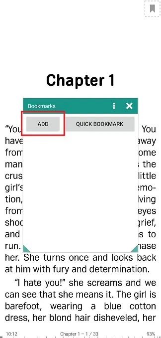
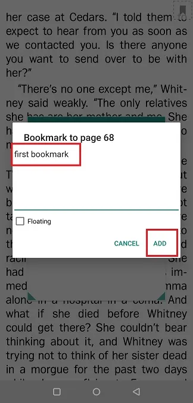
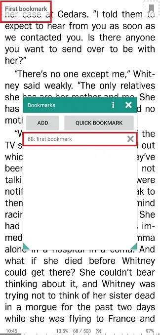
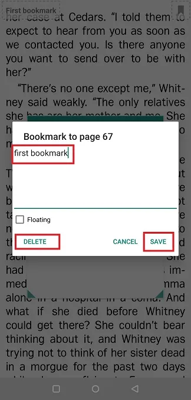
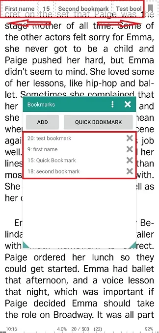
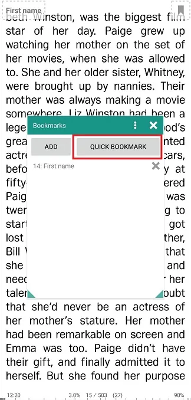
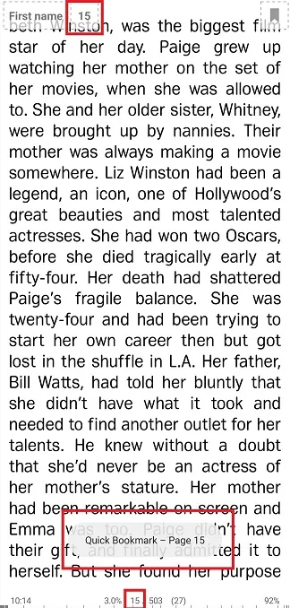
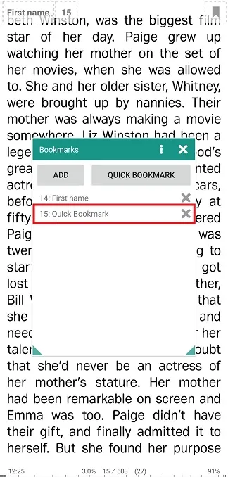

# العمل مع الإشارات المرجعية في الوضع الموسع (شريط الإشارات المرجعية)

> يمكنك جعل **Librera** يعرض إشاراتك المرجعية على الشاشة في جميع الأوقات أثناء قراءة كتاب. سيتم عرضها عبر الجزء العلوي من الشاشة فيما يسمى _ شريط الإشارات المرجعية_. يجب أن يكون وضع الإشارة المرجعية الممتد هذا مفيدًا عندما تحتاج إلى إضافة إشارات مرجعية جديدة أو التبديل بينها في لمح البصر.
> نتوقع زيادة الطلب على هذه الميزة الرائعة من الموسيقيين أثناء تشغيل التطبيق في وضع الموسيقي. لذلك ، يأتي مع تمكين الشريط في هذا الوضع افتراضيًا.

لتمكينه في الأوضاع الأخرى:

* اضغط على أيقونة _Settings_ لفتح نافذة **التفضيلات**
* اضغط على علامة التبويب _Status Bar_
* في لوحة علامات الشريط _ الإشارات المرجعية ، حدد المربع بجوار الوضع الذي تنوي تمكين الشريط لـ.

||||
|-|-|-|
||||

يتم توضيح العمليات التي تحتوي على علامات _ الشريط في وضع _Book_. كل شيء يعمل نفسه بالنسبة لجميع الأوضاع الثلاثة.

> إذا لم تعد بحاجة إلى _Bookmark Ribbon_ ، فيمكنك تعطيله عن طريق إلغاء تحديد المربع المعني في علامة التبويب _Status bar_.

||||
|-|-|-|
||||

**إضافة إشارات مرجعية**

> تشير الإشارة المرجعية العائمة في الركن الأيمن العلوي إلى أنك في وضع الإشارات المرجعية في الوقت الحالي.

* اضغط على إشارة مرجعية في الصفحة التي أنت على وشك المرجعية
* اضغط _ADD_ لإضافة الإشارة المرجعية فعليًا عبر نافذة _Bookmarks_
* اكتب تعليقًا على الإشارة المرجعية. لاحظ أن اسم الإشارة المرجعية يأتي من تعليقك (**أول إشارة مرجعية** في مثالنا).
* اضغط **ADD** لإكمال الإجراء.

||||
|-|-|-|
||||

ستظهر الإشارة المرجعية الجديدة في نافذة _Bookmarks_ ، وفي الوقت نفسه ستراها في علامة _ الشريط المرجعية في الأعلى. الآن ، من أجل العودة إلى هذه الإشارة المرجعية ، تحتاج فقط إلى النقر عليها في الشريط.

> ملاحظة: سيفتح الضغط لفترة طويلة على إشارة مرجعية في الشريط نافذة تحرير.
* احفظ نتائج التعديل من خلال النقر **وفر**
* أو يمكنك حذف الإشارة المرجعية من خلال النقر على **DELETE**

سيصبح الشريط عبارة عن شريط كامل الشريط على شاشتك عندما يكون لديك العديد من الإشارات المرجعية. يمكنك التنقل من خلال الضربات الشديدة للإصبع.

||||
|-|-|-|
||||

**إضافة إشارات مرجعية سريعة**

* اضغط على إشارة مرجعية في أعلى الزاوية اليمنى لفتح نافذة _Bookmarks_.
* اضغط على **كتاب سريع**
* وبالتالي يتم إنشاء &quot;إشارة مرجعية سريعة&quot; ، يشار إليها برقم الصفحة في الشريط في الأعلى. في القائمة في نافذة _Bookmarks_ ، ستذهب كصفحة # و _Quick Bookmark_ بجانبها.
> يمكنك الضغط لفترة طويلة على إشارة مرجعية سريعة في القائمة لتمكين التحرير أو الحذف في نافذة تحرير إشارة مرجعية منبثقة.

||||
|-|-|-|
||||

> يمكنك تجاوز بعض العمليات عند إضافة إشارات مرجعية أو حذفها باستخدام علامات _ الشريط المرجعية:

* الضغط لفترة طويلة على إشارة مرجعية في الزاوية اليمنى العليا سيضيف إشارة مرجعية سريعة.
* سيفتح الضغط لفترة طويلة على إشارة مرجعية في _Bookmarks Ribbon_ مطالبة تشير إلى حذفها.
