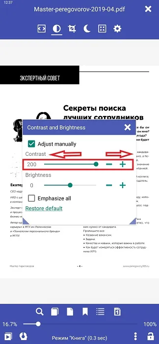
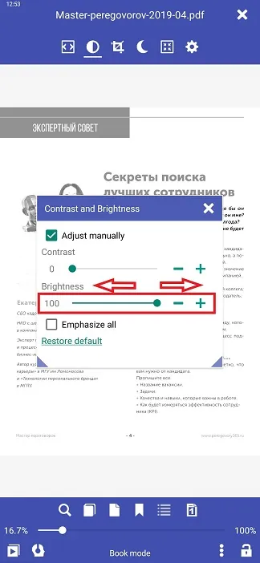
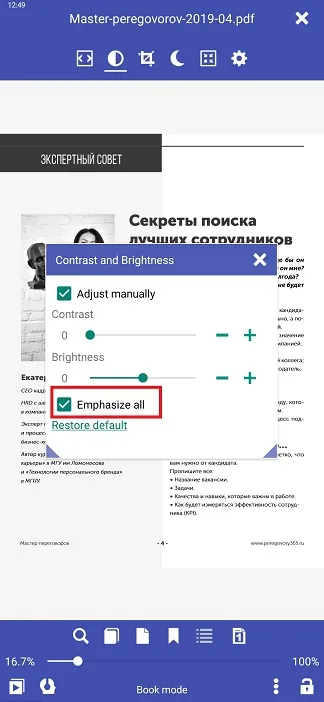

# Contraste y brillo en PDF (efecto blanco/negro)

> La legibilidad de PDF en **Librera Reader** se puede mejorar significativamente mediante ajustes manuales en la configuración de brillo y contraste. Cuando cambie al modo manual, su documento se mostrará en blanco y negro y verá los resultados de sus ajustes en tiempo real en segundo plano, detrás de la ventana **Contraste y Brillo**.
> Los ajustes imitan el efecto de uso frecuente en los lectores de tinta electrónica.

Puede ajustar la siguiente configuración:
* Contraste
* Brillo
* O/y puede aplicar la configuración automática _Emphasize all_ (un efecto de letra en negrita)

> Las tres configuraciones se pueden aplicar por separado o puede usar las tres combinadas.

## Contraste
* Toque el icono _Contraste/Brillo_ en el menú central-toque
* Marque la casilla _Ajustar manualmente_ en la ventana **Contraste y Brillo** y use el control deslizante _Contrast_ (o **-** y **+**) para ajustar la configuración.
* Toque fuera de la ventana (o en la _x_ en su esquina superior derecha) para cerrarla.

||||
|-|-|-|
||||

## Brillo
* Toque el icono _Contraste/Brillo_ en el menú central-toque
* Marque la casilla _Ajustar manualmente_ en la ventana **Contraste y Brillo** y use el control deslizante _Brillo_ (o **-** y **+**) para ajustar la configuración.
* Toque fuera de la ventana (o en la _x_ en su esquina superior derecha) para cerrarla.

||||
|-|-|-|
||||

## Destacar todo (efecto de letra en negrita)
* Toque el icono _Contraste/Brillo_ en el &quot;menú de toque central&quot;
* Marque la casilla _Ajustar manualmente_ y luego la casilla _Enfatizar todo_
* Toque fuera de la ventana (o en la _x_ en su esquina superior derecha) para cerrarla.

||||
|-|-|-|
||||

> Para descartar la configuración manual, use el enlace _Restore default_ en la parte inferior de la ventana **Contraste y Brillo**.
