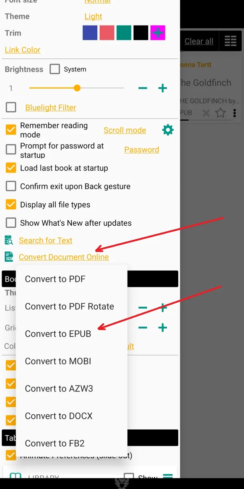
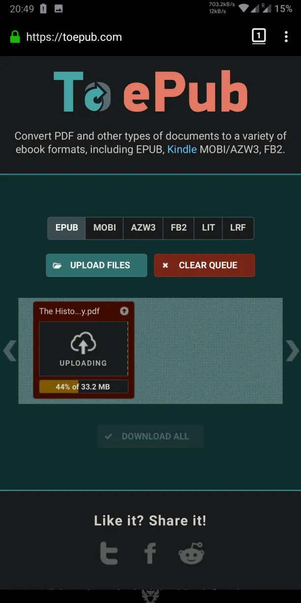
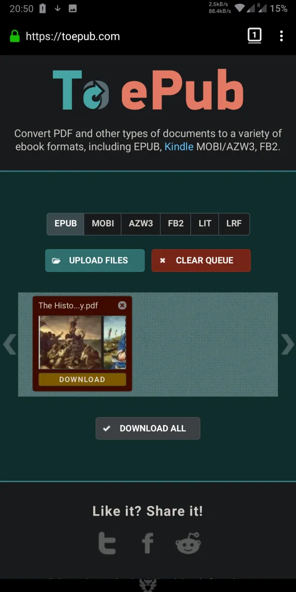
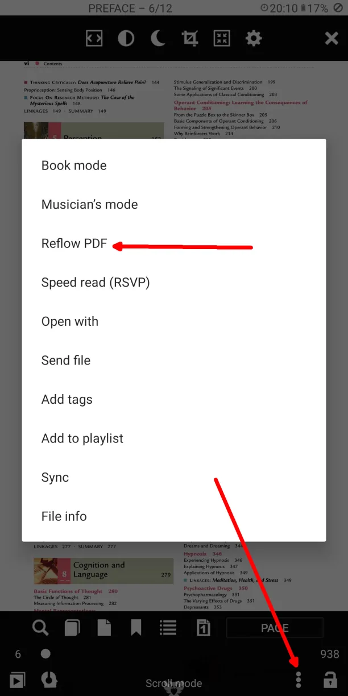
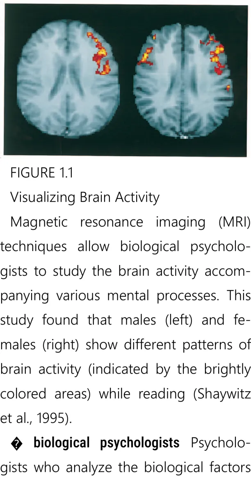

# Преобразование PDF в EPUB

> **Librera** поможет вам преобразовать любой формат книги в другой формат с помощью онлайн-ресурсов. Кроме того, вы также можете конвертировать PDF в EPUB, используя внутренний _Reflow PDF_ режим приложения.

**Доступ к онлайн-конвертерам**

Нажмите на ссылку _Convert Document Online в раскрывающемся меню **Параметры**.

Выберите _Convert to EPUB_

* Конвертируйте ваш PDF файл в EPUB
* Загрузите документ PDF и начните конвертацию
* Скачать документ в формате EPUB

|1|2|3|
|-|-|-|
||||

**_Reflow PDF_ Mode (Внутреннее преобразование PDF)**

Параметр _Reflow PDF_ преобразует документ PDF в формат EPUB в автономном режиме.
> Все изображения в документе будут сохранены.

* Нажмите на трехточечный значок внизу, чтобы открыть меню книги.
* Коснитесь элемента _Reflow PDF_ в меню книги
* PDF документ в более удобной для глаз презентации
* PDF и EPUB версии на вкладке _Recent_

|4|5|6|
|-|-|-|
||||
> **Результат преобразования (EPUB) будет сохранен в папке _Librera/Downloads_ (внутреннее хранилище).**
