# Налаштування шрифтів і стилів

> **Librera** дає змогу налаштувати зовнішній вигляд документа, який ви читаєте,— вибирати шрифти на свій смак і налаштовувати їх розмір, налаштовувати стилі CSS та змінювати перші літери на початкові ініціали (FB2).

Все перераховане вище ви будете виконувати на головній вкладці вікна **Налаштування** і, очевидно, на вкладці _Налаштування читання_.

> Торкніться значка **Налаштування**, щоб відкрити вікно **Налаштування**.

||||
|-|-|-|
||||

## Коригування шрифту

* Виберіть основний шрифт, натиснувши посилання _Font_ і пройшовши розкривний список доступних шрифтів.

> Ви можете додати свої улюблені шрифти до списку:
1. Створіть папку з назвою _Fonts_ у внутрішній пам'яті вашого пристрою.
> Примітка. У вашій внутрішній пам’яті є ще одна папка _Fonts_, яка вже автоматично створена **Librera**.
2. Збережіть свої улюблені шрифти до папки _Fonts_ (або власної папки _Fonts_ **Librera**).
> (Ви також можете завантажити деякі гарні шрифти з нашого сайту. Інструкції див. у розділі **Налаштування читання**.)
> Пам’ятайте, що ваші шрифти будуть прийняті лише в тому випадку, якщо _Стилі_, які ви вибрали на вкладці **Налаштування читання**, мають _Визначені користувачем_.

Щоб налаштувати спеціальні шрифти для різних стилів шрифтів, торкніться значка поруч із посиланням _Fonts_, щоб відкрити вікно _Configure Fonts_.

* Торкніться налаштування для кожного стилю та виберіть для нього шрифт.
* Використовуйте кнопки * * вгору* *  та * * вниз* * , щоб перейти до наступного шрифту у списку (іноді цього буде достатньо для ваших цілей).
* Не забудьте натиснути * * ЗАстосувати* * , коли закінчите.

||||
|-|-|-|
|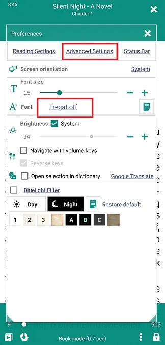|||

||||
|-|-|-|
||||

## Провідні ініціали в книгах FB2

Ви можете зробити так, щоб кожен розділ у своїй книзі починався з красивих ініціалів.
 
> Це налаштування не відображатиметься під час читання в будь-якому іншому форматі.

* Торкніться значка поруч із посиланням _Fonts_, щоб відкрити вікно _Configure Fonts_
* Поставте прапорець _Основні розділи з ініціалами_, щоб увімкнути ініціали
* Торкніться посилання шрифту, щоб вибрати шрифт для ініціала зі спадного списку
* Тепер виберіть розмір і колір для ініціала, натиснувши відповідні посилання
* Торкніться * * ЗАСТОЯТИ* * , щоб зберегти налаштування

||||
|-|-|-|
|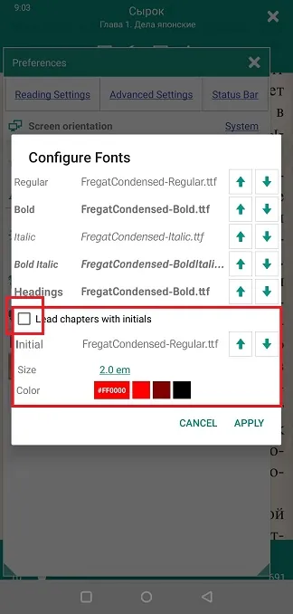|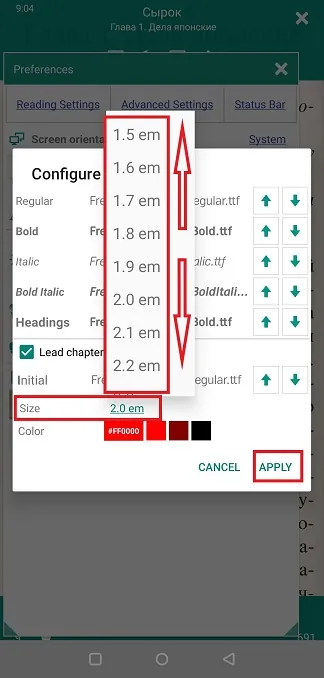||

## Вкладка **Налаштування читання**

> Це налаштування, визначені користувачем. Вони переважно замінюють налаштування стилю, закодовані у файлі .css вашої книги. Вам потрібно вибрати _Визначені користувачем_ стилі, щоб він працював.

* Виберіть бажане вирівнювання тексту зі спадного списку.
* Використовуйте повзунки або натискання * * -* *  та * * +* * , щоб налаштувати інтервал між рядками та абзацами, відступи тексту та поля сторінки.
* Шляхом _нормалізації розміру шрифту_ ви робите всі шрифти в документі однаковими (1em, звичайний).
* Ви також можете вказати колір посилань у своєму документі для кожного режиму (день і ніч).

||||
|-|-|-|
|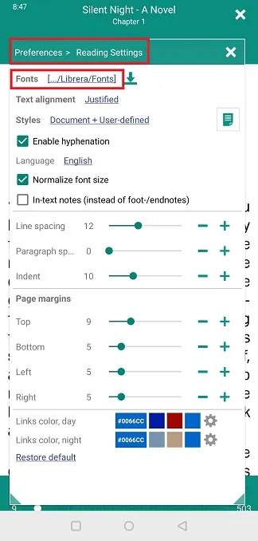|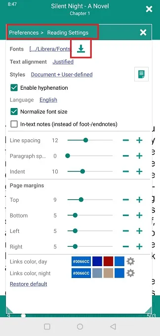|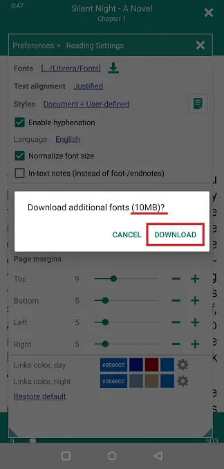|

**Вибирайте _Стилі_ для своєї книги розумно**

* _Document_, будуть використані налаштування .css книги
* _User-defined_, будуть використовуватися налаштування цієї вкладки
* _Document + User-defined_ (за умовчанням, рекомендовано), наша спроба включити налаштування користувача в налаштування .css книги (або навпаки). Працює більшість часу!

## Вікно **Спеціальний код CSS**

Це вікно відкривається після натискання на піктограму поруч із _Styles_

Ті, хто знайомий з кодуванням CSS, можуть налаштувати спосіб відображення вашої книги. (Див. більше в розділі &quot;Поширені запитання&quot; **Налаштування стилів CSS книги**).

> Не забудьте видалити код, коли закінчите роботу з книгою! У наступному це може не спрацювати.

||||
|-|-|-|
|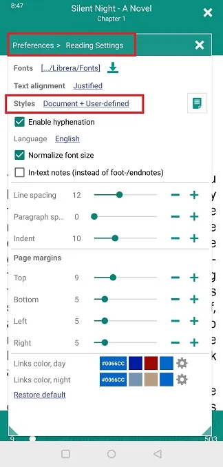|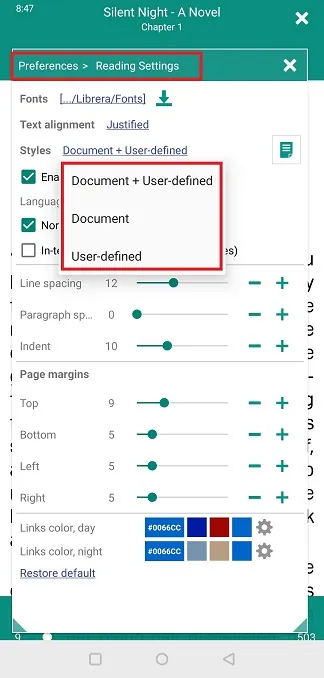|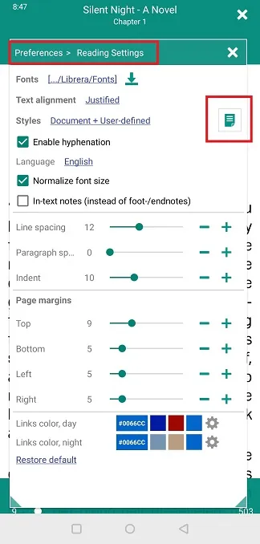|

||||
|-|-|-|
|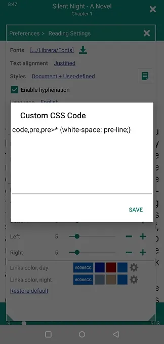|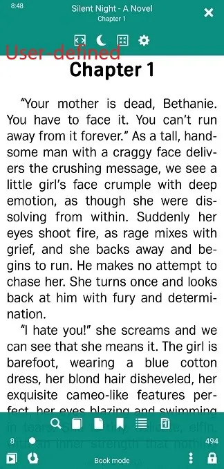|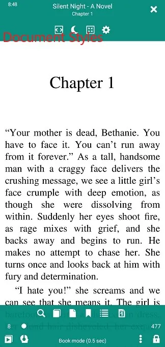|
