# Тематизація інтерфейсу Librera

> **Librera** дозволяє налаштувати кожну деталь інтерфейсу користувача.

На панелі _Загальні налаштування_ вкладки **Налаштування** ви можете вибрати свої особисті:

* Розмір шрифту
* Мотив і колір теми
* Колір обрізки
* Колір посилання

||||
|-|-|-|
||||

**Налаштування розміру шрифту**

* Торкніться _Розмір шрифту_, щоб відкрити спадний список відносних розмірів шрифту
* Виберіть розмір шрифту, зменшуючи або збільшуючи поточний розмір шрифту

||||
|-|-|-|
|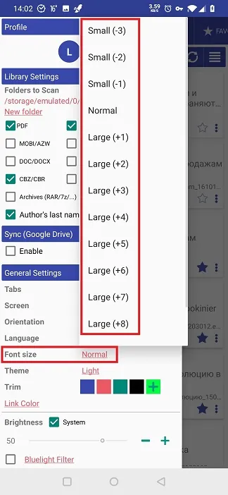|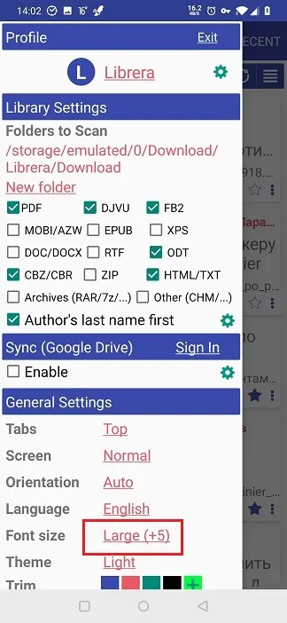|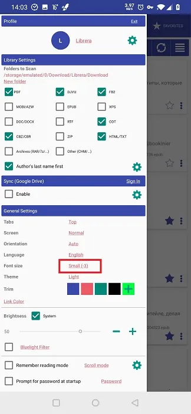|

**Загальне налаштування теми**

* Торкніться _Theme_, щоб відкрити спадний список доступних тем
* Виберіть потрібну тему. Ви також можете вибрати тему для екранів E-Ink.

> _Під час налаштування режимів читання «День/Нічний» ви отримаєте додаткову тематику, вибравши кольори та шрифти_

||||
|-|-|-|
|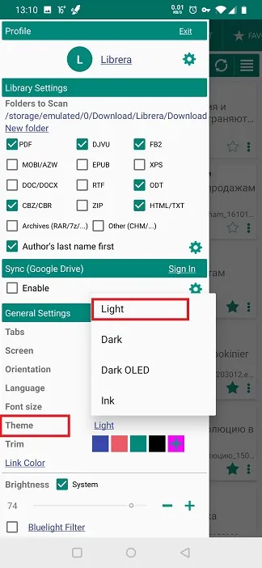|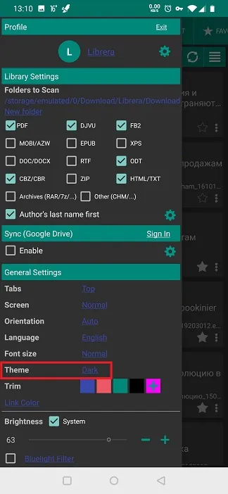|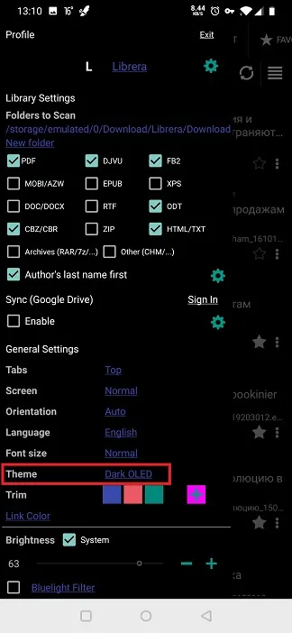|

**Налаштування кольору заголовка та заголовка (обрізка)**

* Ви можете вибрати один із доступних налаштувань, торкнувшись його
* Або ви можете вибрати щось зовсім інше, натиснувши * * +* * 
* Виберіть свій колір із відкритої палітри кольорів

||||
|-|-|-|
|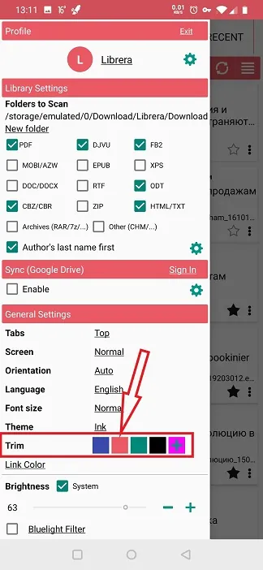|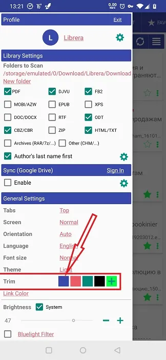|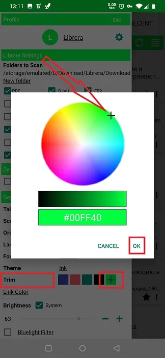|

**Налаштування кольору посилання**

* Вам потрібно _Увімкнути_ користувацькі кольори, перевизначивши налаштування системи
* Виберіть один із доступних налаштувань, торкнувшись його
* Або ви можете вибрати щось зовсім інше, натиснувши * * +* * 
* Виберіть свій колір із відкритої палітри кольорів

||||
|-|-|-|
|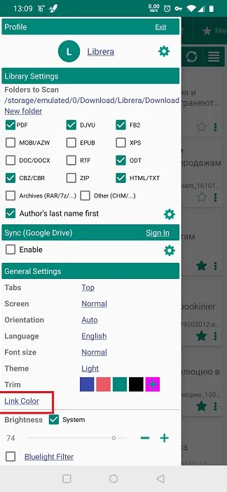|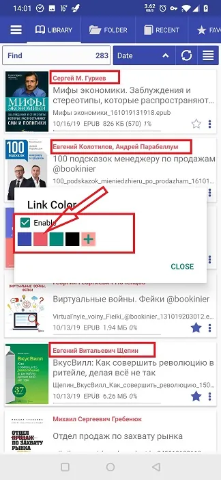|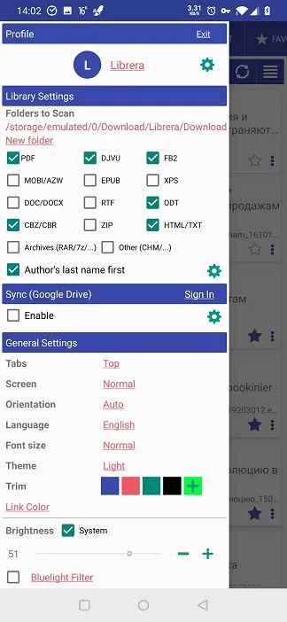|

> **Найкраще, що пропонує *Librera*, — це можливість окремо створювати кожен профіль, який ви створюєте в ньому. Ви можете створювати теми для своїх профілів для змін настрою, читання вдень і вночі, жанрів книг тощо.**
