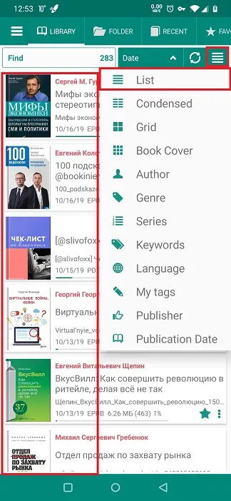
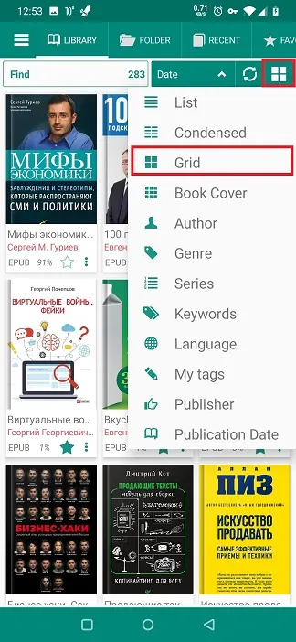
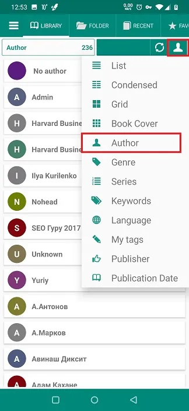
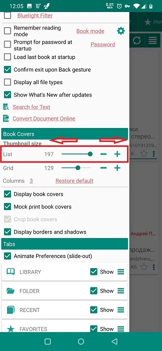
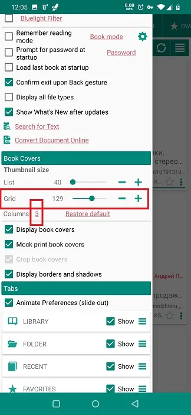

# Personalizzazione dell'aspetto e della sensibilità della tua libreria

> **Librera** ti consente di regolare il modo in cui i tuoi libri vengono visualizzati sugli &quot;scaffali&quot; della tua Biblioteca. Puoi modificare il numero di libri su uno scaffale, il loro aspetto, le dimensioni dello scaffale, il raggruppamento e l'elenco dei libri, ecc.

I tuoi libri vengono mostrati nella scheda _Library_, dove puoi apportare modifiche alla presentazione del libro. Le impostazioni aggiuntive che influiscono sulla vista Libreria si trovano nella scheda _Preferenze_ scorrevole, nel pannello _Libri Covers_.

* Per modificare il layout del libro (elenco, griglia, condensato, ecc.), Tocca l'icona dell'hamburger nell'angolo in alto a destra della scheda _Library_
* Scorri verso destra dal bordo sinistro dello schermo per aprire la scheda _Preferenze_

> Se hai la casella _Preferences_ selezionata (nessuna animazione), troverai la scheda _Preferences_ accanto alla scheda _Library_ in alto.

* Scorri verso il basso e trova il pannello _Book Covers_

||||
|-|-|-|
||||

* Di seguito sono riportati esempi delle viste di alcune scelte di layout:
 
> Ricorda, un altro layout è a soli due tocchi di distanza. Puoi passare a quello più conveniente in qualsiasi momento.

||||
|-|-|-|
||||

## Il pannello _Book Covers_

* Puoi scegliere di non vedere le copertine dei libri deselezionando la casella corrispondente
* Hai ancora molte opzioni di layout

||||
|-|-|-|
||||

* Le tue manipolazioni con le dimensioni delle copertine dei libri dipenderanno dal layout che hai scelto (elenco o griglia)
* Per &quot;elenco&quot;, utilizza il rispettivo dispositivo di scorrimento per modificare le dimensioni delle copertine dei libri (dimensioni dello scaffale)

||||
|-|-|-|
||||

Avrai più opzioni per &quot;griglia&quot;.

* Usa il rispettivo cursore per modificare le dimensioni delle copertine dei libri
* Puoi anche scegliere il numero di colonne nella griglia della tua Libreria

> Nota: è sempre possibile ripristinare le impostazioni iniziali toccando _ Ripristina predefinito_ e confermando l'operazione con _OK_.

**Se scegli di visualizzare le copertine dei tuoi libri, usa altre opzioni nel pannello _Libri Covers_ per migliorare la vista.**

||||
|-|-|-|
||||
