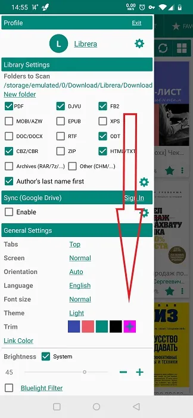
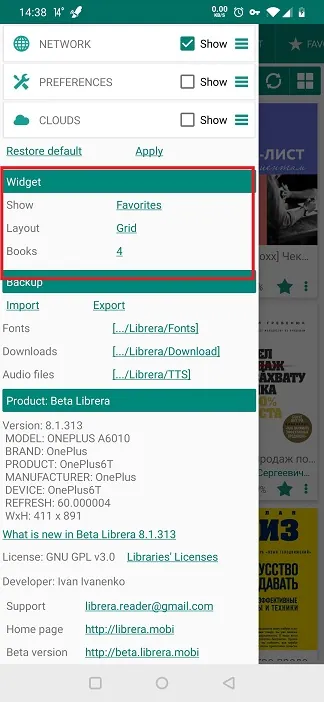

#使用_Librera_的小部件

>窗口小部件将帮助您直接从设备的桌面启动**Librera**。并随您选择的书。

要开始使用**Librera**的小部件，应通过启动器中的_Widgets_标签将其放置在桌面上。

||||
|-|-|-|
||||

##自定义小部件

* 打开滑出式菜单* * “首选项”* * 标签，然后向下滑动到_Widget_面板

||||
|-|-|-|
||||

* 您可以通过在_Favorites_和_Recent_文档之间进行选择来告诉窗口小部件显示什么
* 在* * Librera* * 的小部件中选择书籍的布局
* 您可以通过增加或减少小部件书架上的图书数量来选择* * Librera* * 小部件的尺寸

||||
|-|-|-|
||||
