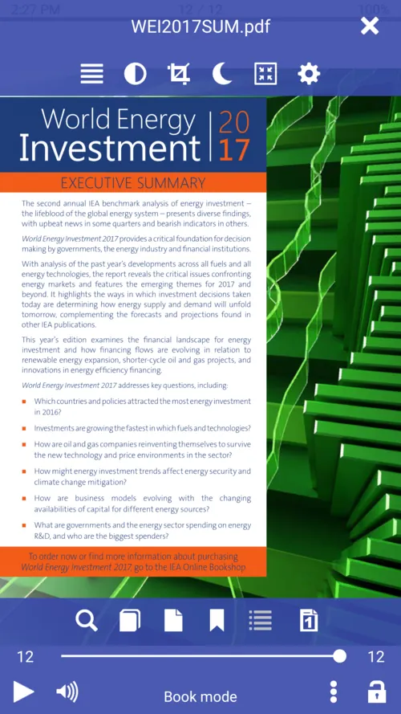
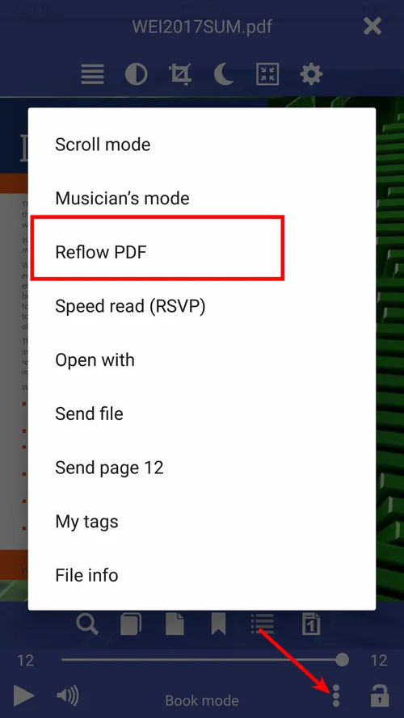
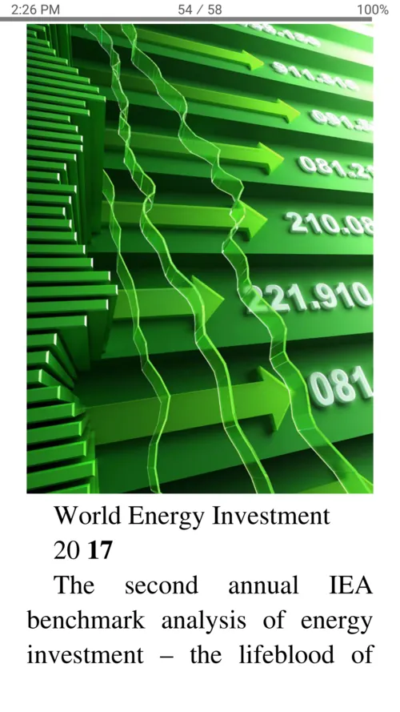
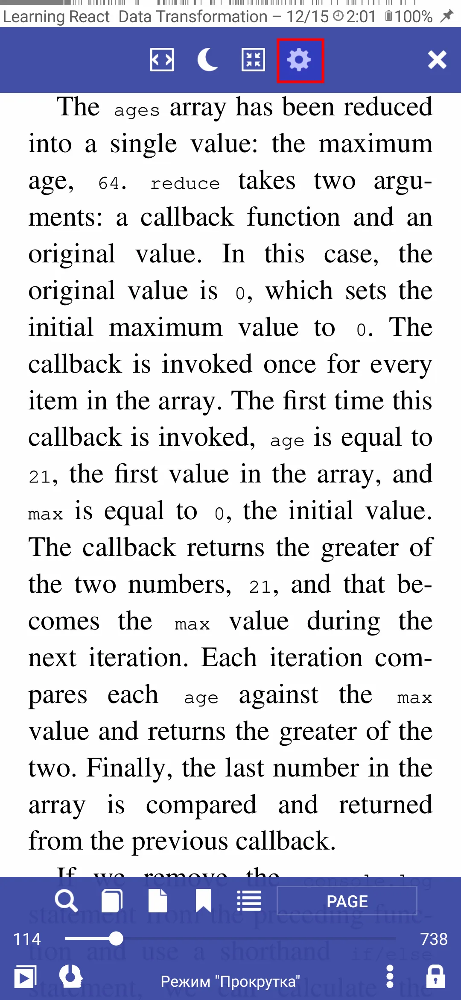
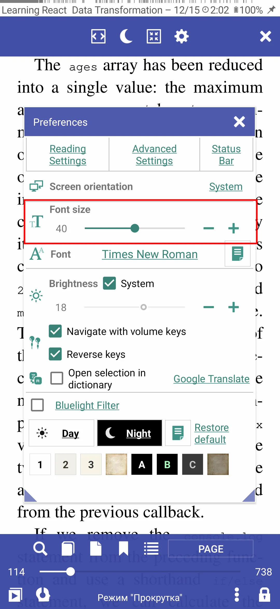
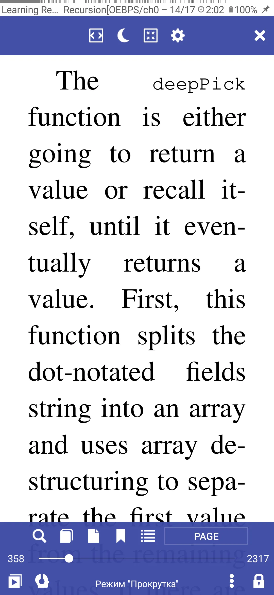

# زيادة حجم الخط في مستندات PDF

لتحسين قابلية قراءة مستند PDF (حجم حرف صغير جدًا) ، يمكنك تحويله في **Librera** إلى تنسيق ملف آخر (EPUB):
* افتح وثيقة PDF الخاصة بك في **Librera**
* افتح القائمة العامة بالنقر على الشاشة المركزية
* اضغط على أيقونة قائمة الكتب (أيقونة ثلاثية النقاط) في أسفل الشاشة
* اضغط على عنصر _Reflow PDF_ ، انتظر انتهاء التحويل ، ثم قم بتغيير حجم الخط في نافذة **التفضيلات**.

|1|2|3|
|-|-|-|
||||
||||

