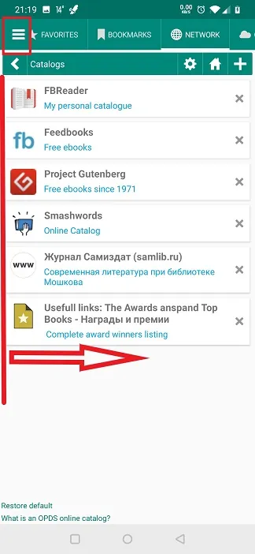
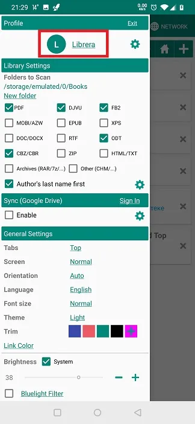
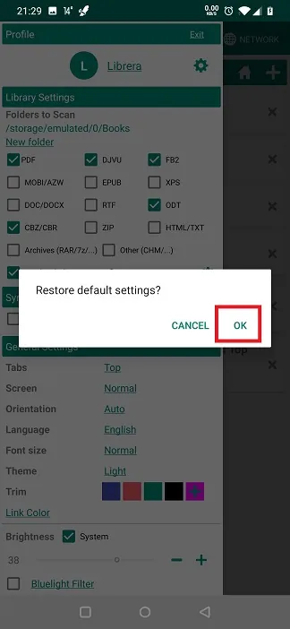

# Как восстановить настройки по умолчанию/очистить кэш

> **Librera** - очень гибкое приложение, которое позволяет вам настраивать и настраивать множество его настроек, используя их пользовательский интерфейс и условия чтения. Очевидно, может случиться так, что вам не понравятся некоторые результаты ваших экспериментов с настройкой **Librera**. Не волнуйтесь! Всегда есть способ легко и быстро вернуть приложение в исходное состояние. Во многих отношениях это похоже на очистку кеша (а иногда это именно то, что есть).

## Сброс профиля

> Иногда проще отменить нежелательные изменения на уровне профиля, вернув текущий профиль в его первоначальное состояние (момент создания). Просто следуйте этим простым шагам:
* Нажмите и удерживайте имя текущего профиля на панели _Profile_ на вкладке **Предпочтения**.
* Подтвердите свое намерение во всплывающем диалоговом окне, нажав _OK_

**Примечание. Ваши закладки, теги и результаты чтения не будут удалены или сброшены!**

||||
|-|-|-|
||||

## Восстановление значений по умолчанию

> Предвидя ваши обширные эксперименты с настройками **Librera**, мы предоставили большое количество из них с простым в использовании инструментом для отмены изменений и восстановления их начальных значений.
* Просто нажмите на ссылку _Restore default_ поблизости и начните заново
> Смотрите примеры ниже:

||||
|-|-|-|
||||

## Переименование режимов чтения и изменения клиринга

> Благодаря своей бесконечной гибкости **Librera** позволяет изменять названия режимов чтения. Это также позволяет вам восстановить их всего за один простой шаг.
* Коснитесь значка настроек рядом с _Помните режим чтения_ на выдвижной вкладке **Предпочтения**
* Нажмите _Edit_ в окне **Режим чтения**, чтобы сделать имена редактируемыми.
* Переименуйте режимы и нажмите _Сохранить_
* Чтобы отменить изменения и вернуться к именам по умолчанию, нажмите и удерживайте _Edit_

||||
|-|-|-|
||||

> **Если по какой-либо причине вы застряли с чем-то, что не работает должным образом, и вам нужен «чистый лист», вы можете удалить _Librera Reader_ из системы и вручную удалить папку _Librera_ из внутреннего хранилища в ваше устройство.**
