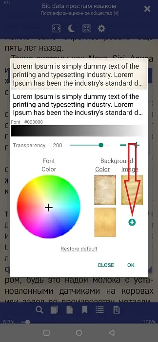

# Налаштування фону сторінки

> **Librera** дозволяє користувачеві читати свої книги на фоні, який можна налаштувати. Користувач може мати певний фон для кожного профілю, який можна налаштувати окремо для денного та нічного режимів читання. Фон може бути суцільним кольором, або користувач може додавати до них текстури (або зображення) із зразків файлів **Librera**або використовуючи власні зображення.

## Налаштування власного фону
* Торкніться значка налаштувань, щоб відкрити вікно * * Налаштування* * 
* Торкніться _Day_, щоб змінити фон для денного режиму (або _Night_ для нічного режиму)
* На панелі _Background_ ви зможете змінити колір і текстуру фону (або ви можете просто повісити власне зображення у фоновому режимі)
* Прозорість фонового зображення можна змінити, перетягнувши повзунок _Transparency_

||||
|-|-|-|
||||

## Зміна суцільного фону
* Торкніться * * Колір* * , щоб відкрити палітру кольорів з хрестиком, і перетягніть хрестик навколо палітри (стежте за змінами в попередньому перегляді сторінки в режимі реального часу вгорі)
* Ви можете зробити свій однотонний фон світлішим або темнішим, перетягнувши повзунок через колірну смугу
* Не забудьте натиснути _OK_, щоб зберегти зміни, коли ви закінчите

||||
|-|-|-|
||||

## Додавання текстури або зображення до фону
* Торкніться * * Зображення* *  на панелі _Background_
* Ви можете використовувати будь-який із вбудованих файлів текстур, торкнувшись його
* Щоб додати власне зображення, торкніться * * +* *  і перейдіть до папки із зображенням, яке ви збираєтеся додати
* Знайдіть своє зображення, торкніться його, а потім натисніть _SELECT_
* Налаштуйте його прозорість за допомогою попереднього перегляду в реальному часі
* Торкніться _OK_, коли закінчите

||||
|-|-|-|
||||

> Ви завжди можете використовувати попередні налаштування фону та шрифту, показані на рис. 2. Їх можна досить легко редагувати у вікні **Налаштувати** (торкніться значка редагування, позначеного фіолетовою стрілкою).
