# Настройка строки состояния

> Вы можете настроить строку состояния **Librera** так, чтобы отображать тонны полезной информации на вашем экране чтения ... или вы можете полностью удалить ее, что раздражает.

Вы можете внести все изменения в строку состояния на вкладке _Status Bar_:
* Нажмите в центре экрана, чтобы вызвать главное меню
* Нажмите на значок настроек
* Откройте вкладку _Status Bar_

||||
|-|-|-|
||||

По умолчанию строка состояния находится внизу экрана. Используйте раскрывающийся список _Position_, чтобы изменить его местоположение.
> Обратите внимание! Если выбрана настройка _Top_, заголовок книги, отображаемый всегда в верхнем углу, всегда будет серым.
* Необходимо установить флажок _Show status bar_, если вы хотите, чтобы какая-либо информация отображалась во время чтения книги

||||
|-|-|-|
|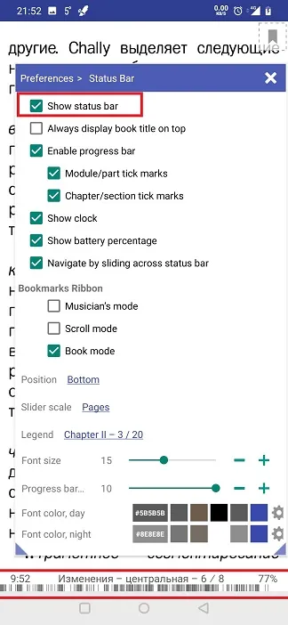|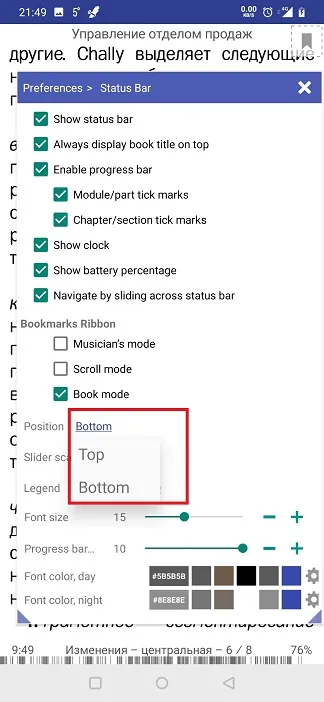|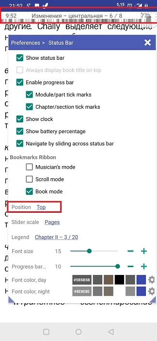|

Установите/снимите флажки в соответствии с вашими предпочтениями. Вы также можете:
* Изменить масштаб ползунка, который всплывает внизу, по центру экрана
* Выберите способ отображения числовой (динамической) информации в строке состояния (главы, страницы, страницы, оставшиеся до конца главы и т. Д.)
* Изменение размера и цвета шрифта строки состояния для дневного и ночного режимов.
* включить/отключить ленту закладок на экране чтения

||||
|-|-|-|
|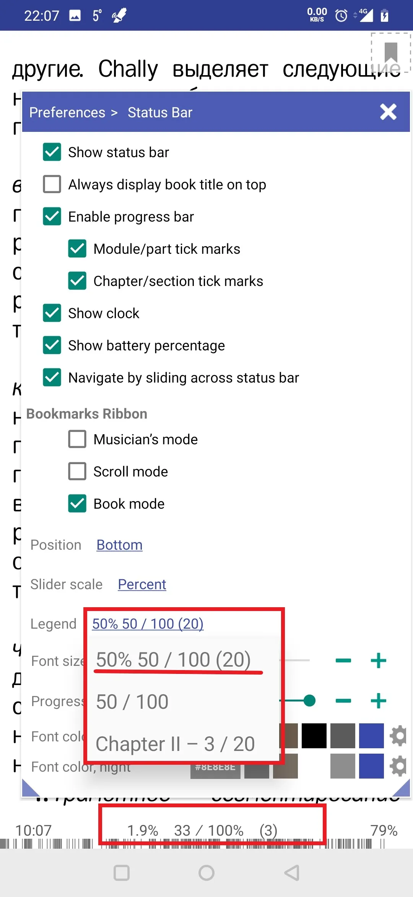|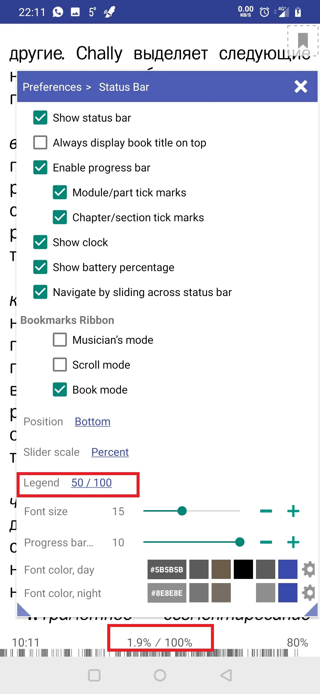|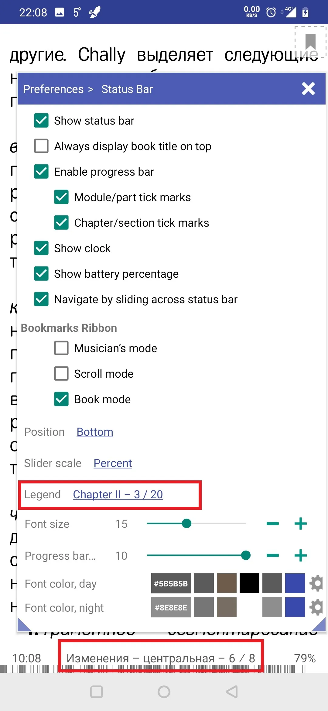|

* Если позиция строки состояния - _Bottom_, вы можете выбрать постоянное отображение названия книги в верхней части экрана (даже если строка состояния не отображается)
* Кроме того, вы можете выбрать текущее время и оставшийся заряд батареи для отображения со статусом книги.
> **Если строка состояния выключена, вы всегда можете посмотреть на часы, коснувшись экрана по центру (посмотрите в верхнем левом углу)**
 
||||
|-|-|-|
|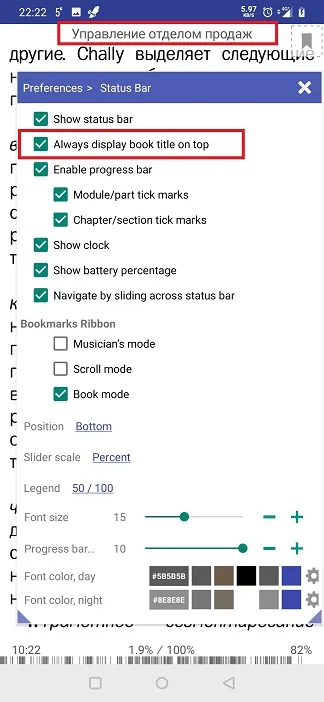|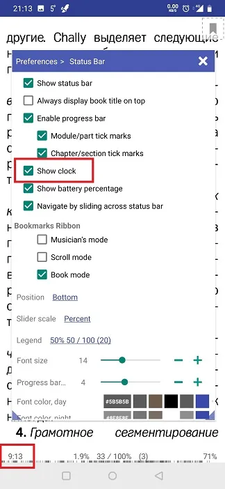|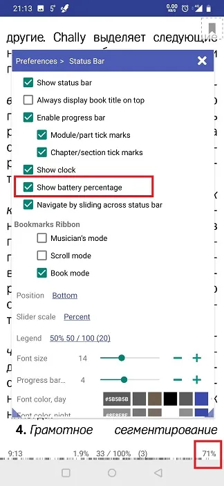|

* включить или отключить индикатор выполнения чтения
* Выберите, какие отметки на индикаторе выполнения вы предпочитаете (если есть)
* Выберите показ ленты закладок на экране чтения

||||
|-|-|-|
|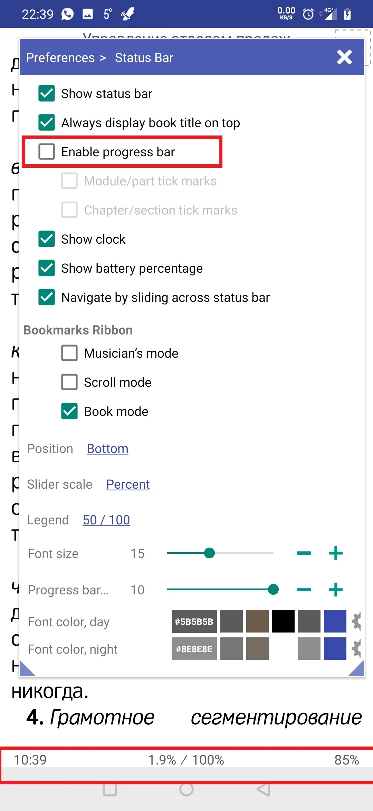|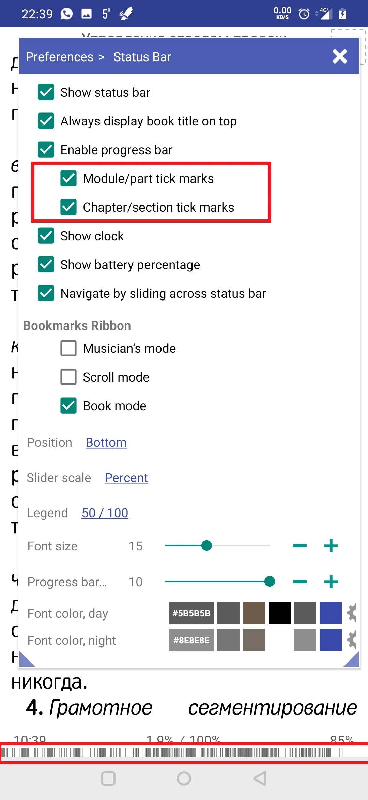|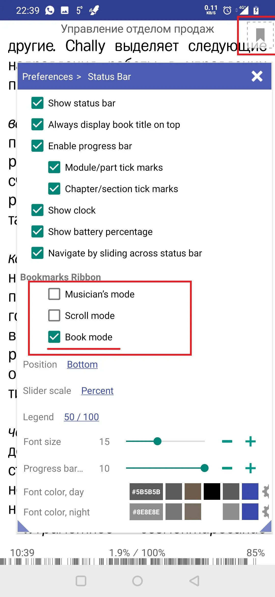|

* Изменение размера и цвета шрифта строки состояния
* Изменить высоту индикатора выполнения

||||
|-|-|-|
|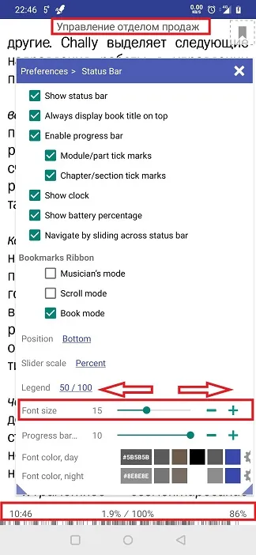|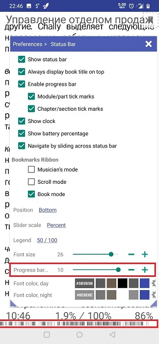|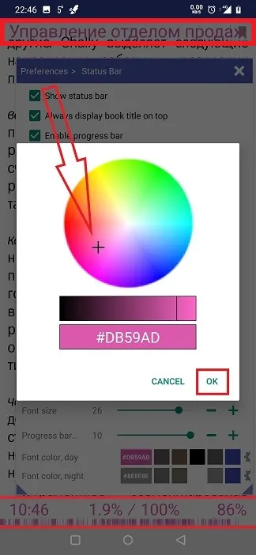|
