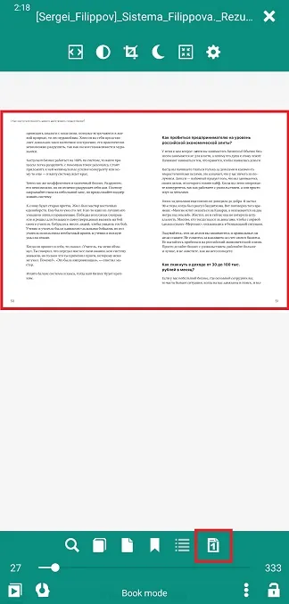
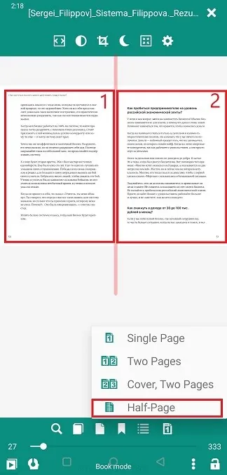
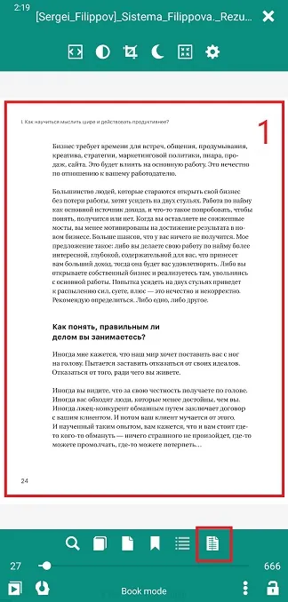

# Opções de exibição/layout de página

> Para garantir uma leitura confortável, o **Librera** permite que o usuário faça ajustes no layout da página em todos os formatos de e-book suportados.

Para acessar as opções de visualização:
* Toque no centro da tela para abrir o menu
* Toque no ícone de layout no canto inferior direito para abrir uma lista suspensa de opções

## Ajustando o layout da página em EPUB, MOBI, FB2, AWZ etc.

* O layout _Single Page_ é preferido para a orientação da tela _Retrato_
* Se a orientação da tela mudar (automática ou manualmente) para _Landscape_, você poderá acompanhar a mudança para o layout _Duas Páginas_
* Volte para _Single Page_ depois de girar o dispositivo para a orientação _Portrait_

> **Você pode predefinir combinações de orientações de tela e layouts de página e usar essas combinações em perfil.**

||||
|-|-|-|
||||

## Ajustando o layout da página em PDF/DjVu

A &quot;rigidez&quot; da página em PDF/DjVu e o tamanho da tela ditarão as opções de layout da página:
* modo _Página única_ ou _Duas páginas_ para orientação _Retrato_ em telas grandes
* Modo _Duas Páginas_, preferido para telas grandes e orientação _Paisagem_
* Às vezes, a página de rosto deve ser apresentada separadamente, principalmente se as ilustrações do seu livro estiverem espalhadas por páginas espelhadas (escolha _Capa, duas páginas_ neste caso)

||||
|-|-|-|
||||

O modo * _Meia Página_ é útil nos layouts de página de duas colunas. Apenas divida sua página em duas escolhendo esta opção

||||
|-|-|-|
||||
