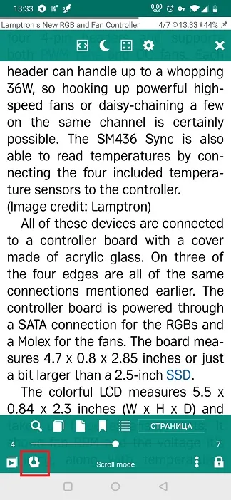
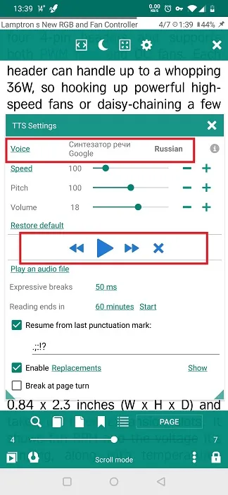
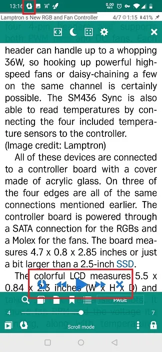

# Using TTS Capability for Reading Shares from Other Apps
> You can share reading material with **Librera** from any application on your device that supports sharing.
> For example, you can share web pages, articles and other interesting stuff from the Internet with **Librera**, save them, and make use of **Librera**'s TTS tools.

To read a web page out loud in **Librera**: 
* Open the page in your browser. 
* Tap on the _Share_ icon in your browser menu (Google Chrome, in our example)
* Select **Librera** from the dropdown list of available apps
* Select a reading mode for your browser's share. Note: you can remember the mode selected for future references by ticking off the respective checkbox.

||||
|-|-|-|
||||

Now, once the web article from the browser is opened in **Librera**, you can fine-tune its readability: enable hyphenation, for starters.

||||
|-|-|-|
||||

Now you can make **Librera** read the web page for you out loud:
* Tap on the **TTS** icon in the bottom left corner
* In the **TTS Settings** window, check if a TTS engine is installed (or select the one you will use if you have plenty). If there is none, we recommend you to install the Google TTS Engine off Google Play. 
* Select the language for the engine to use.
* Hit _Play_ and enjoy.

> You can close the **TTS Settings** window if you don't need any further fine-tuning. The playback controls will remain for your convenience at the bottom of the screen.
* To exit TTS mode, tap the _X_ icon.

||||
|-|-|-|
||||
