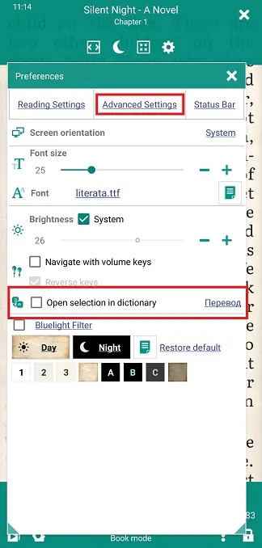
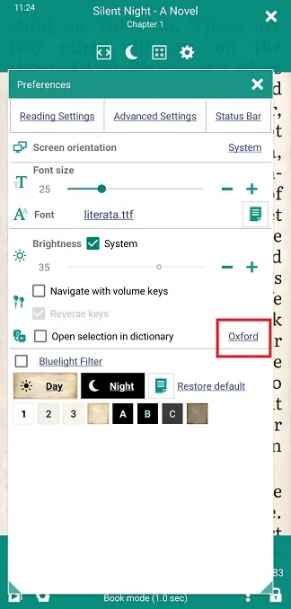
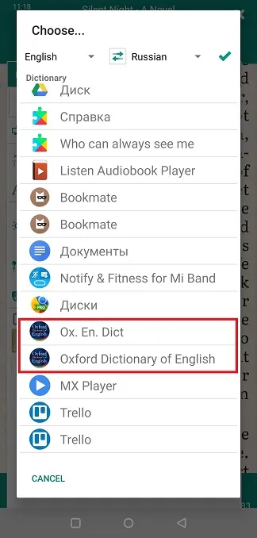
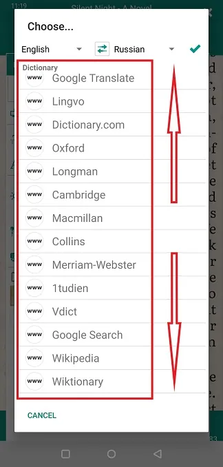
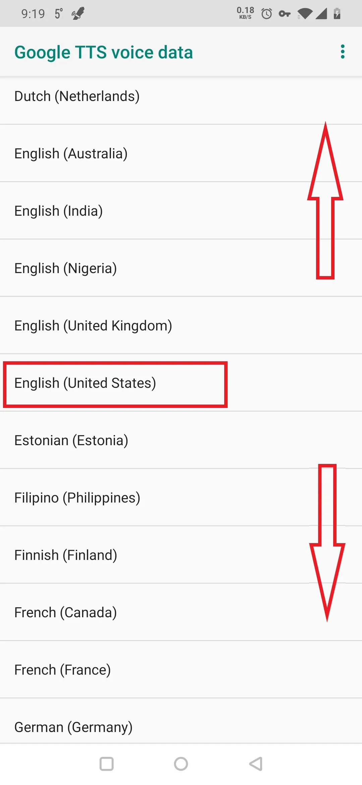
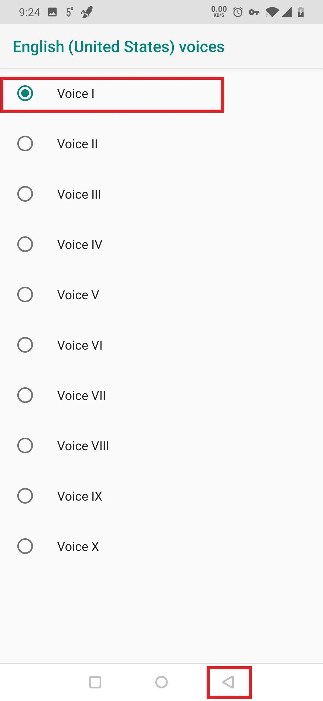
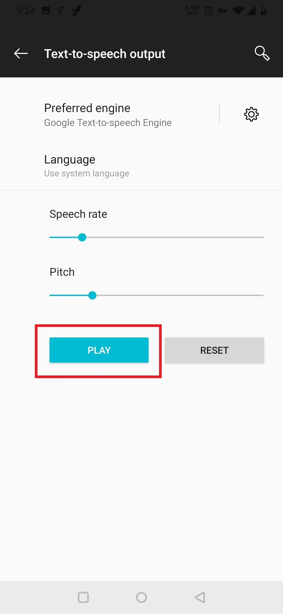

# Verwenden einer Text-to-Speech-Engine mit _Librera_

> **Librera** kann Ihre Bücher (und andere Dokumente) mithilfe einer auf Ihrem Android-System installierten Text-to-Speech-Engine (TTS) eines Drittanbieters laut vorlesen. Es unterstützt das Vorlesen für eine Vielzahl von E-Book-Formaten, von EPUB über Kindle bis PDF.

# Auswahl einer TTS-Engine

* Tippen Sie unten auf dem Bildschirm auf das TTS-Symbol, um das Fenster **TTS-Einstellungen** zu öffnen
* Tippen Sie auf **&quot;i&quot;**, um eine Dropdown-Liste der TTS-Engines zu öffnen
* Wählen Sie die gewünschte Suchmaschine aus. Wenn die von Ihnen ausgewählte Engine noch nicht auf Ihrem System installiert ist, werden Sie zum Google Play Store weitergeleitet. Befolgen Sie die Anweisungen für Ihre bevorzugte Engine, um sie einzurichten, Haupt- und Zusatzstimmen herunterzuladen usw.

> Hinweis: Möglicherweise werden Ihnen von den Entwicklern der Engine zusätzliche Funktionen in Rechnung gestellt, z. B. zusätzliche Stimmen.

||||
|-|-|-|
||||

## Beispiel: Einrichten der Google Text-to-Speech-Engine

* Folgen Sie im Fenster **TTS-Einstellungen** von **Librera** dem _Voice_-Link zur Einstellungsseite **Text-to-Speech-Ausgabe** Ihres Systems
* Tippen Sie auf das Einstellungssymbol neben &quot;Bevorzugte Suchmaschine&quot;.
* Tippen Sie auf _Stimmdaten installieren_, um Ihre TTS-Sprache und -Sprache auszuwählen
* Testen Sie die ausgewählte Stimme, indem Sie auf der Seite **Text-to-Speech-Ausgabe** auf _PLAY_ tippen

> Sie können die Einstellungen des Motors (z. B. Lesegeschwindigkeit, Tonhöhe und/oder Lautstärke) im Fenster **Librera** **TTS-Einstellungen** anpassen.

||||
|-|-|-|
||||

||||
|-|-|-|
||||

> Hinweis: Die Spracheinstellung in anderen TTS-Engines erfolgt auf ähnliche Weise. Denken Sie daran, dass Sprachdateien sehr groß sein können. Stellen Sie sicher, dass Ihre begrenzten Mobilfunkdaten nur über eine WiFi-Verbindung heruntergeladen werden.
