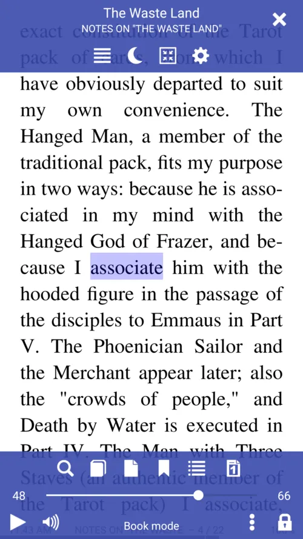
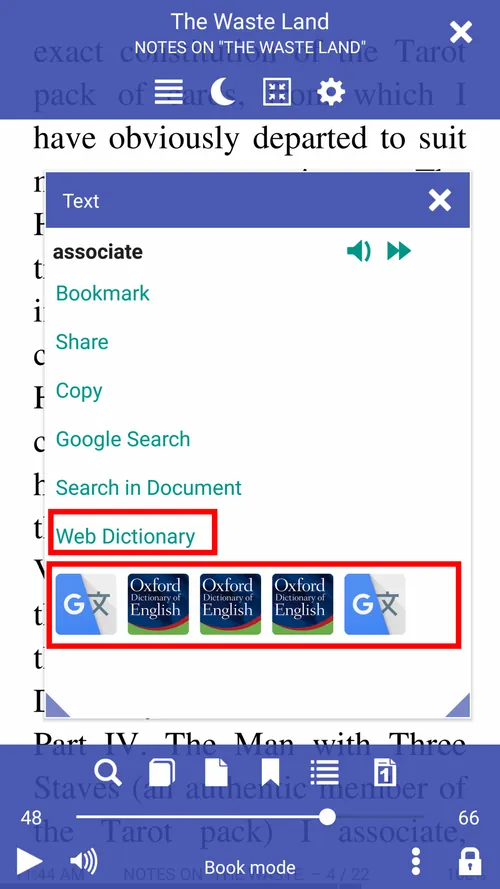
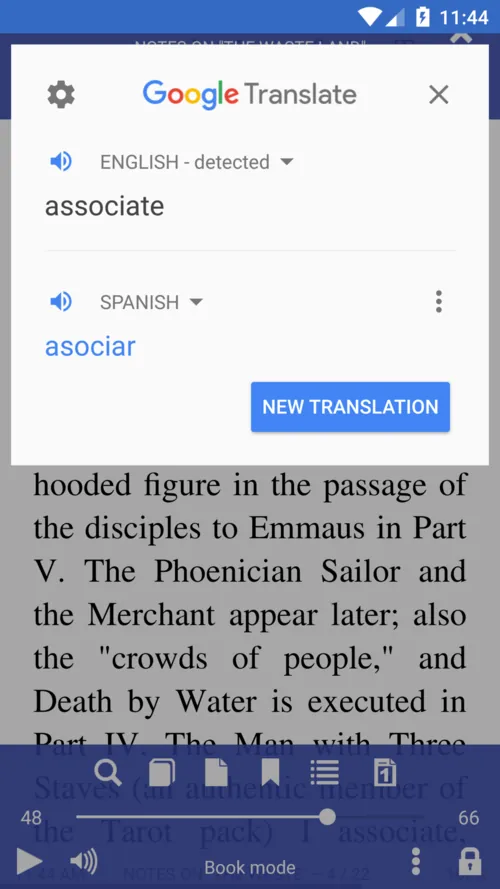
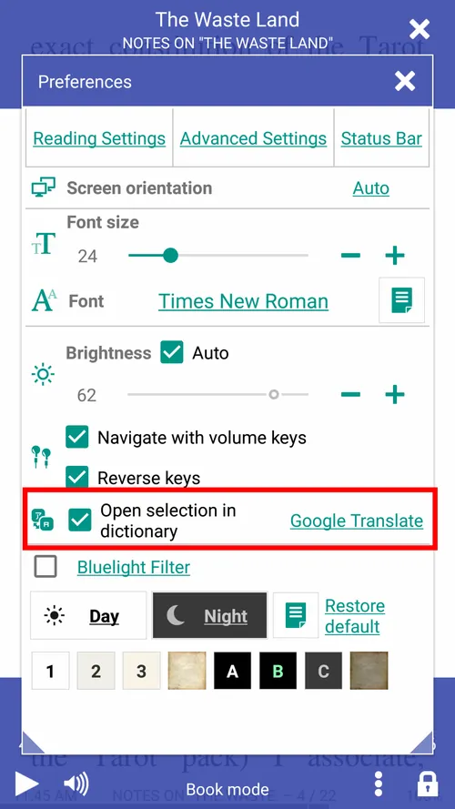
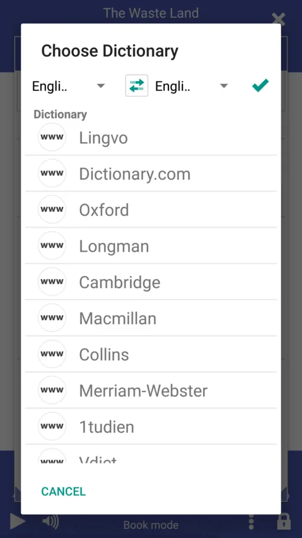
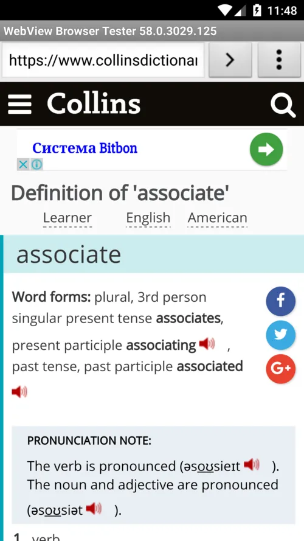

# Usando * Librera * para aprender línguas estrangeiras

> * Librera Reader * é uma excelente ferramenta para quem aprende uma língua estrangeira ... ou simplesmente lê um livro em outra língua.

Basta usar o dedo (qualquer dedo) para destacar/selecionar o texto
* Traduza com facilidade e rapidez uma palavra, passagem ou página selecionada
* Configure o **Librera** para trabalhar com tradutores e/ou dicionários online e offline

||||
|-|-|-|
||||

* Ative a pesquisa de dicionário de toque único (pressão longa) (marque a caixa)
* Isso também vale para traduções de passagens se o seu &quot;dicionário de escolha&quot; for, por exemplo, o Google Tradutor (verifique se a sua conexão com a Internet está funcionando)
> Nota! Você pode configurar o **Librera** para selecionar palavras com um único toque na guia _Configurações avançadas_ (não recomendado)

||||
|-|-|-|
||||

Se a seleção _Abrir no dicionário_ estiver desmarcada, você verá várias opções na janela _Texto_:
* Faça **Librera** pronunciar a palavra para você ou leia sua seleção em voz alta para você
* Faça com que leia o livro inteiro em voz alta (leitura acompanhada de voz)
* Abra a palavra/passagem em outro dicionário/tradutor
* Marque páginas com sequências de palavras significativas

||||
|-|-|-|
||||

> Você pode reproduzir arquivos de áudio externos com o **Librera**. Ele suporta todos os formatos de áudio usados com freqüência, por exemplo, .mp3, .mp4, .wav, .ogg, .m4a e .flac.
* Reproduza audiolivros juntamente com suas cópias de e-books (leitura acompanhada por voz)
* Controle o ritmo da sua leitura com os controles de reprodução na parte inferior
* Use a janela **Favoritos** para navegar no livro

||||
|-|-|-|
||||

> **Pressione e segure o botão Play/Pause para rebobinar a faixa desde o início.**
