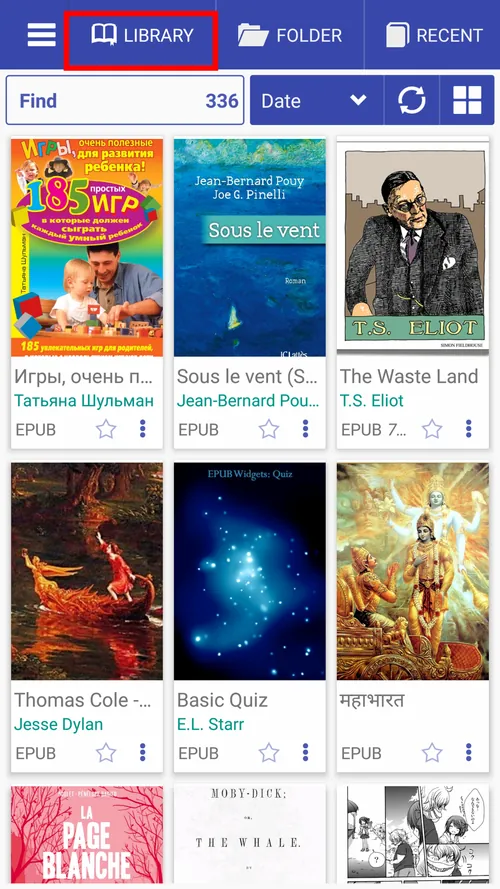
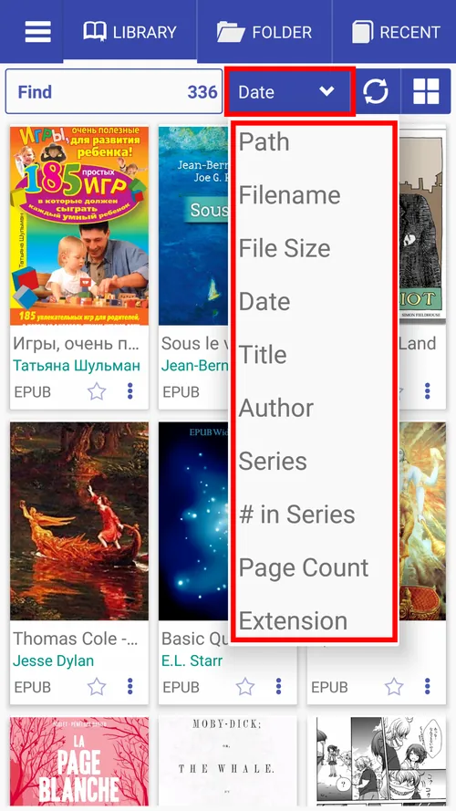
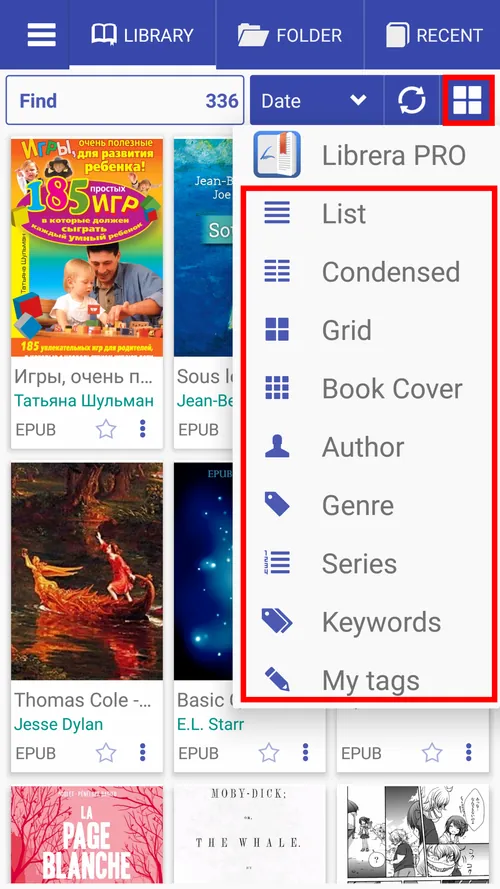
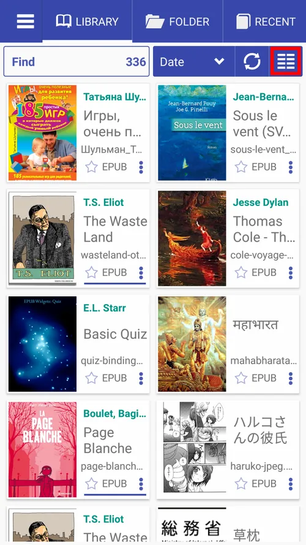
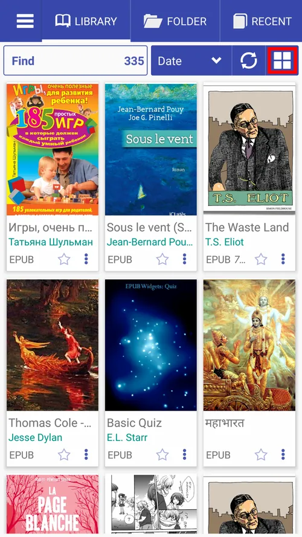
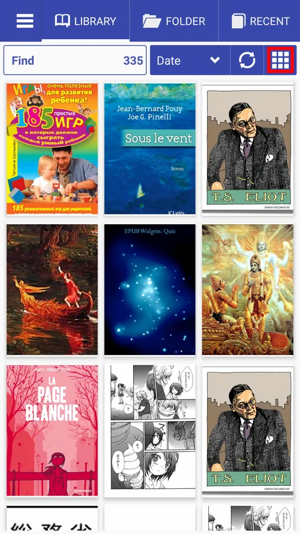

# Navegando por la pestaña _Library_

> Una vez instalado, **Librera** se abrirá de manera predeterminada con su pestaña _Biblioteca_, repleta de información útil sobre los libros (y otros documentos) encontrados en su dispositivo. Aquí hay una guía rápida sobre la pestaña _Library_.

* La pestaña _Library_, vista predeterminada
* Ordenar libros en los estantes de su Biblioteca de acuerdo con ciertos criterios (por nombre de archivo, autor, fecha, etc.)
* Puede cambiar la forma en que se exhiben sus libros en los estantes cambiando el diseño de la Biblioteca (lista, cuadrícula, portadas de libros, etc.)

||||
|-|-|-|
||||

* Vista condensada (dos columnas)
* Vista de cuadrícula
* Cubiertas de libros solamente

||||
|-|-|-|
||||

* Encuentra libros en tu biblioteca
* Toque el icono de estrella para agregar un libro a **Favoritos**
* Toque el ícono de triple punto para abrir el menú del libro
* Al presionar prolongadamente el ícono de estrella, se le pedirá que agregue una etiqueta personalizada
* Toque #Historia para agregar una etiqueta personalizada a un libro
* Mantenga presionada la tapa de un libro para abrir la ventana **Información del libro**

||||
|-|-|-|
||||

* Encuentre un libro por extensión (FB2, en nuestro ejemplo a continuación)
* Toque el nombre del autor para encontrar todos los libros de este autor en la Biblioteca
* Toque _x_ para borrar los resultados de búsqueda
* Mantenga presionada la marca de verificación para ver y editar el historial de búsqueda y la lista de autocompletar
* Ver **Información del libro** y ver qué tan lejos te encuentras en este libro (Consejo: puedes restablecer tu progreso de lectura a través del menú del libro)

||||
|-|-|-|
||||
