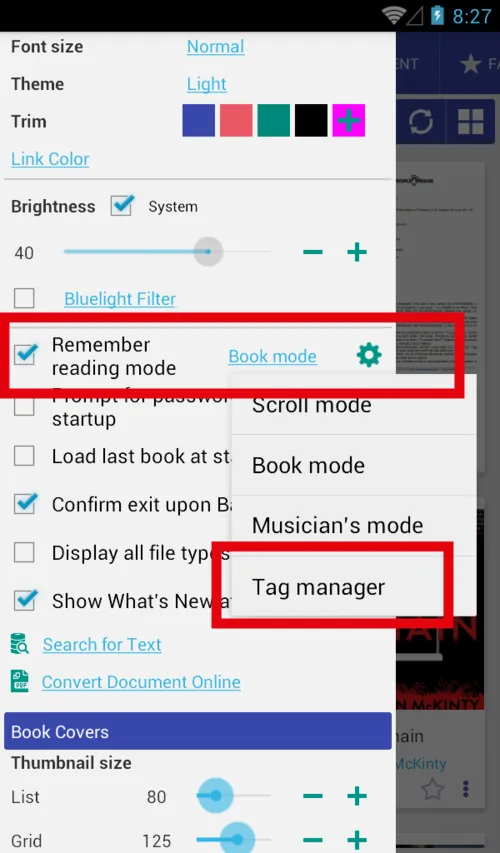
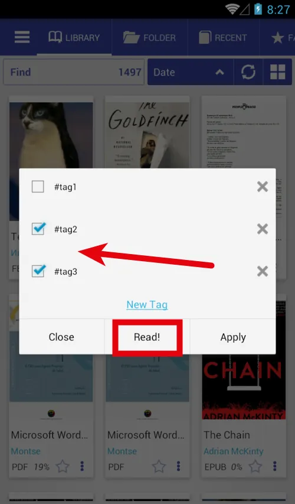
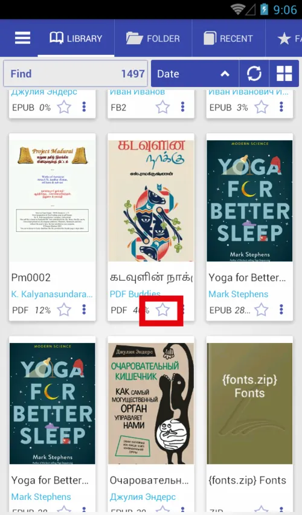
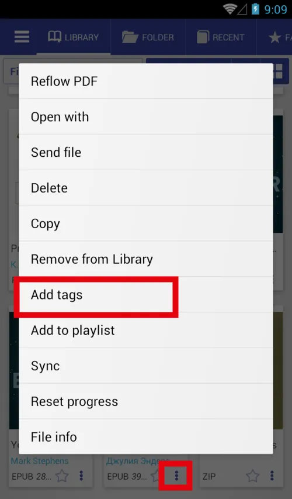
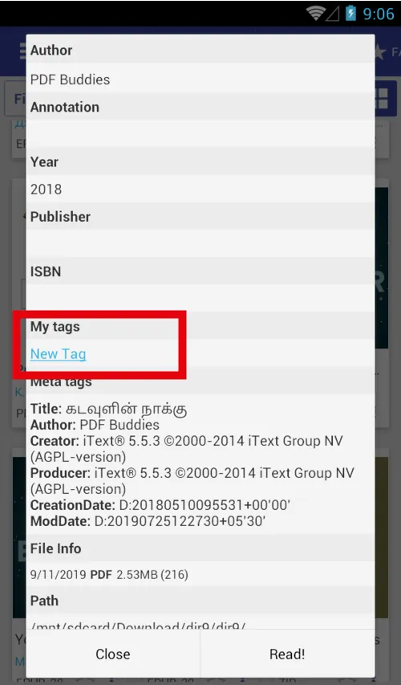

# Open book with "Tag Manager"

> It is possible to organize books in collections with tags. "Tag Manager" simplify this process

It's not possible to set a tag for multiple books but it's possible to open tag manager before book opening.

* Set open with (remember reading mode) to "Tag Manager"
* Click on any book you will see the dialog
* You can set\remove tags and click "Apply"
* You can set\remove tags and click "Read", tags will also be applied
* New tags you can find on the "Favorite" tab

||||
|-|-|-|
||||

# Open tag manager

There are many ways to set\remove tags for the books

* Long press on the star icon to open tag manager
* Open the book menu, click “Add tags”
* File info dialog “Add tags”

||||
|-|-|-|
||||
