# أوضاع القراءة: التمرير والكتاب والموسيقي

> **Librera** يسمح للقارئ بالاختيار من بين ثلاثة أوضاع للقراءة. كل واحد يعالج متطلبات معينة ويمكن للمستخدم التبديل من وضع إلى آخر بسهولة تامة.

في **وضع التمرير** ، يتم تمرير صفحات الكتاب لأعلى ولأسفل باستخدام الضربات الشديدة للإصبع

> يمكنك أيضًا تمكين التمرير التلقائي وإعداد سرعته.

في **وضع الكتاب** ، يتم قلب الصفحات أفقياً باستخدام الضربات الشديدة لليسار من اليسار أو الأسفل (أو الصنابير على حواف الشاشة)

**وضع Musician هو** حالة وضع التمرير التلقائي المصمم خصيصًا للموسيقيين.

* ستظهر لك نقرة على كتاب نافذة **وضع القراءة** لتختار وضع القراءة لهذا الكتاب
* حدد مربع وضع _Remember للقراءة _ وحدد الوضع الافتراضي لجميع الكتب
* يمكنك تعديل أسماء صيغ القراءة بعد النقر على _ تعديل
* الضغط لفترة طويلة على _Edit_ سوف يستعيد الأسماء الافتراضية

||||
|-|-|-|
|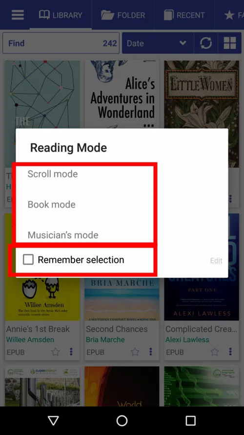|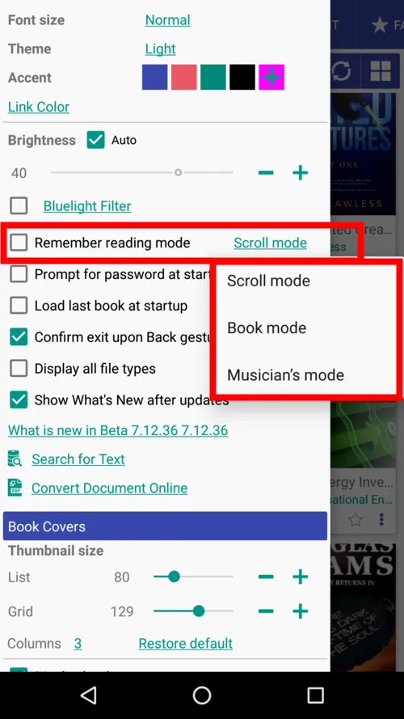|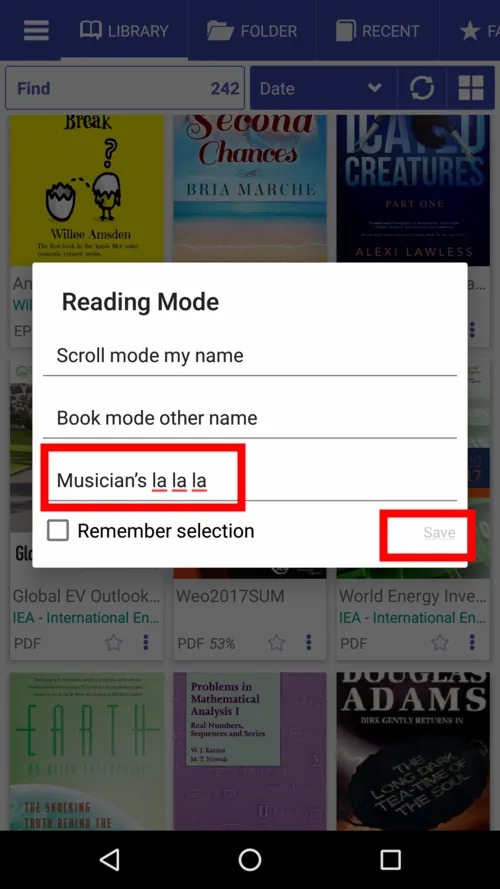|

**يمكنك أيضًا تحديد أوضاع القراءة الافتراضية لكل تنسيق كتاب إلكتروني.**

* اضغط على أيقونة الإعدادات للاتصال بمربع حوار الإعدادات المسبقة
* حدد المربع لتمكين الإعدادات المسبقة وتعديل القوائم إذا لزم الأمر
* لا تنس النقر على _SAVE_ إذا أجريت تغييرات
* يمكنك استعادة القوائم إلى الإعدادات الافتراضية عن طريق النقر فوق _Restore default_

||||
|-|-|-|
|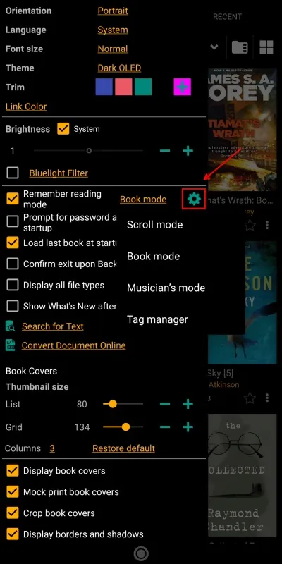|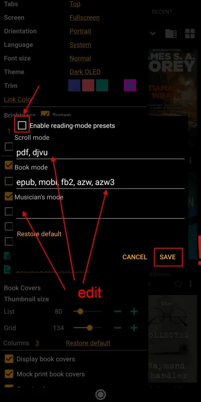|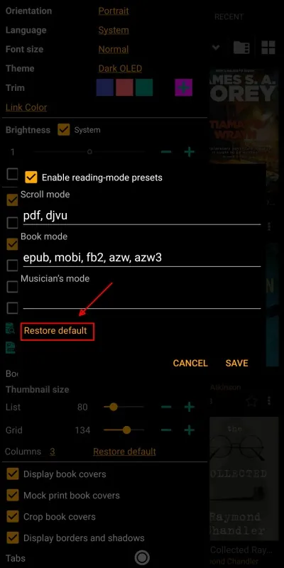|

* لتغيير وضع القراءة لكتاب حالي ، اضغط على الشاشة في منتصف الشاشة ثم اضغط على أيقونة النقطة الثلاثية في الأسفل
* اضغط على الوضع المفضل في مربع الحوار
* فويلا!

||||
|-|-|-|
|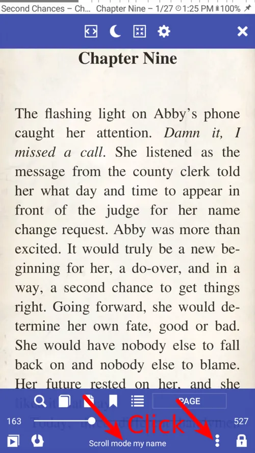|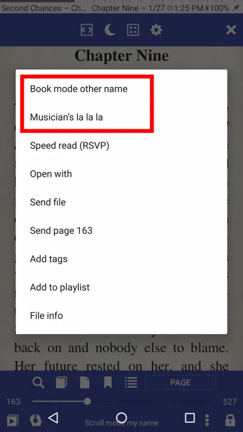|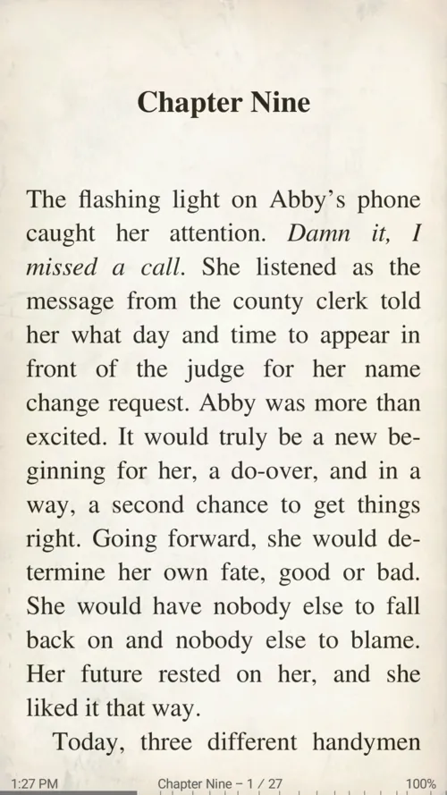|

## وضع التمرير
* اختر مقياس الضربات السريعة للتمرير: حسب الصفحة أو الشاشة أو الإعدادات المسبقة لنسبة الشاشة أو القيمة المخصصة

> **قم بالتمرير باستخدام أزرار مستوى الصوت ، ومفاتيح الأجهزة ، والأزرار الموجودة على جهاز Bluetooth الخاص بك ، والصنابير على الشاشة.**

||||
|-|-|-|
|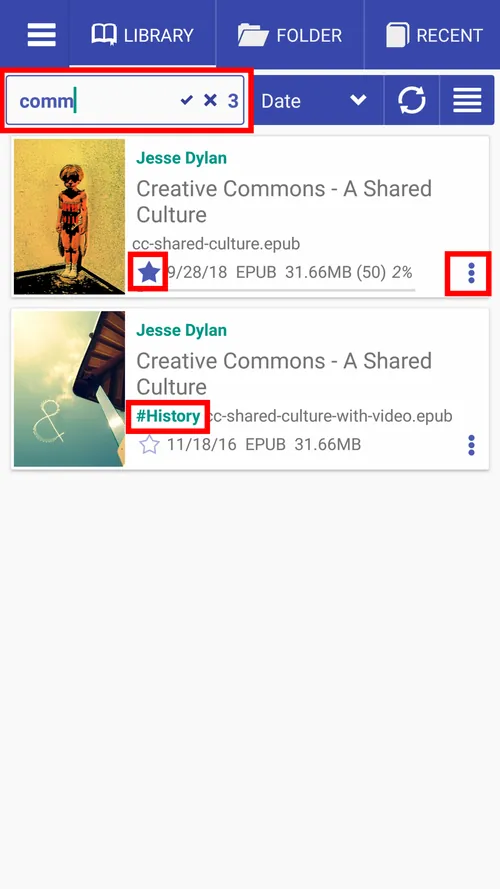|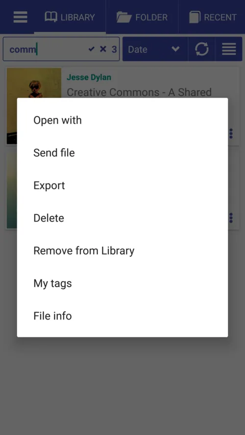|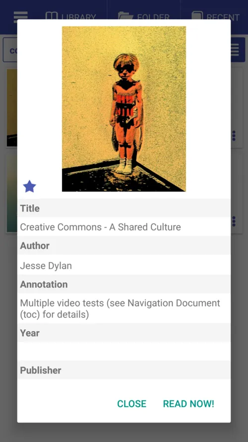|

## وضع الكتاب
* مرر سريعًا للصفحة التالية/السابقة
* اسحب رأسيًا للصفحة التالية/السابقة
* قم بتغيير الاستجابة إلى الضربات الشديدة الرأسية
> **اقلب الصفحات بأزرار الصوت أو مفاتيح الأجهزة أو الأزرار الموجودة على جهاز Bluetooth الخاص بك أو اضغط على الشاشة.**

**فقط تذكر أن مناطق النقر الخاصة بك قابلة للتخصيص من حيث الحجم والإجراء!**

||||
|-|-|-|
|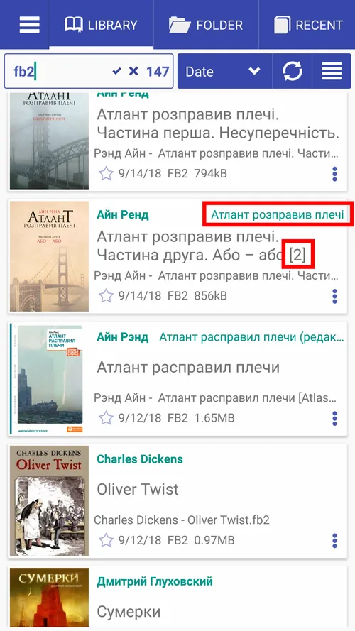|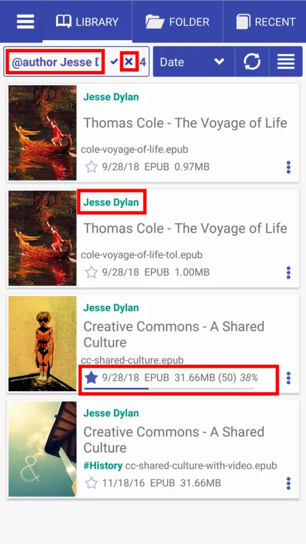|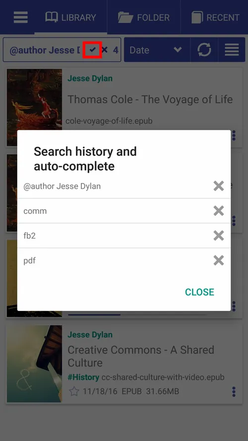|

## وضع الموسيقي
* بنقرة واحدة لبدء/إيقاف التمرير التلقائي
* استخدم الصنابير في المناطق المحددة للانتقال إلى الصفحة التالية/السابقة
* تغيير سرعة التمرير التلقائي أثناء التنقل
* اضغط على الجزء العلوي لإظهار عناصر التحكم
* اضغط على أيقونة الترجيع للعودة إلى البداية في أي وقت

||||
|-|-|-|
|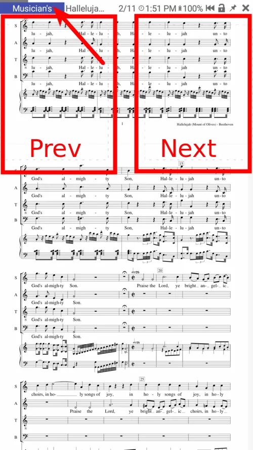|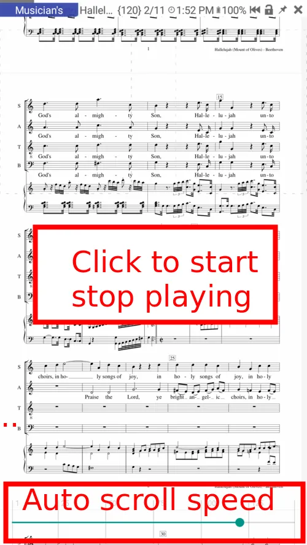|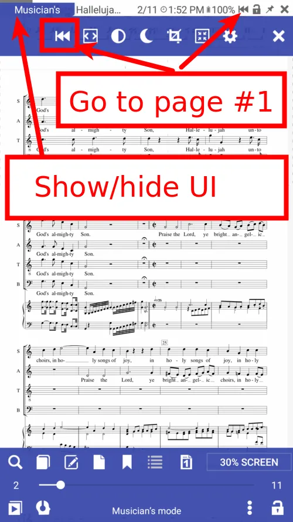|
