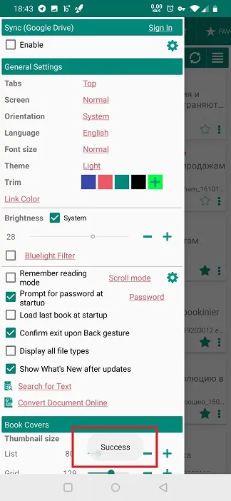
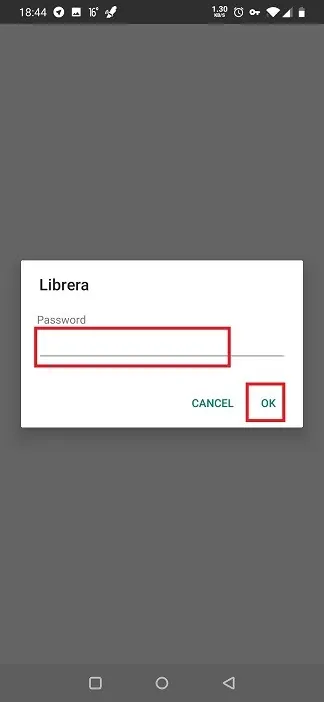
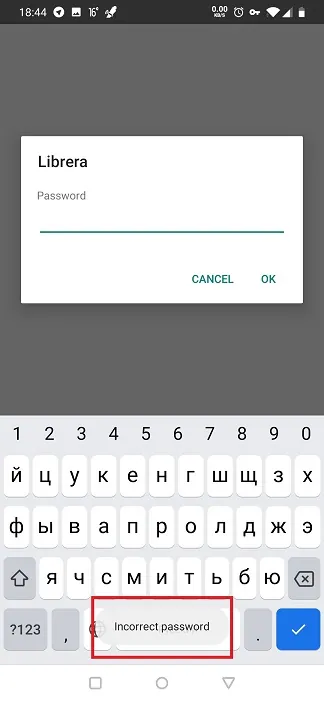

# Настройка защиты по отпечатку пальца или паролю

> В **Librera** вы можете защитить свои наиболее важные документы от просмотра посторонними пользователями, которые могут случайно или иным образом получить доступ к вашему устройству. На самом деле, вы будете защищать ВСЕ свои документы, так как вы ограничиваете доступ к самому приложению.
Документы могут быть защищены от отпечатков пальцев или паролем.

## Включение авторизации при запуске

* Закройте книгу, которую вы сейчас читаете
* Нажмите на вкладку **Предпочтения** и прокрутите вниз до панели _Общие настройки_
* Установите флажок _Prompt for password_
> Если у вас **окно настроек** анимированное, вы можете вызвать его, нажав на значок гамбургера в верхнем левом углу или проведя вправо от левого края экрана.

||||
|-|-|-|
||||

## Защита от отпечатков пальцев

> Чтобы активировать защиту отпечатков пальцев в **Librera**, сначала необходимо настроить доступ к вашему устройству по отпечаткам пальцев.
* В окне **Установить пароль** установите флажок _Allow fingerprint authantication_
* Подтвердите свой выбор, нажав **ОК**

> Вам нужно перезапустить **Librera**, чтобы активировать аутентификацию доступа по отпечатку пальца.

||||
|-|-|-|
||||

## Защита паролем

Настройка пароля входа в систему:

* Введите и повторно введите свой пароль в соответствующие поля окна **Установить пароль** и нажмите **ОК**
> Пароли должны совпадать!
* Подтвердите свой выбор, нажав **ОК**

> Вам нужно перезапустить **Librera**, чтобы защита паролем вступила в силу. С этого момента вам будет предложено ввести пароль на пустом экране при открытии документа в **Librera**.

||||
|-|-|-|
||||

> Чтобы снять защиту с помощью пароля/отпечатка пальца, запустите **Librera**, выполните аутентификацию в приложении, перейдите в поле _Prompt for password_ и снимите флажок.
