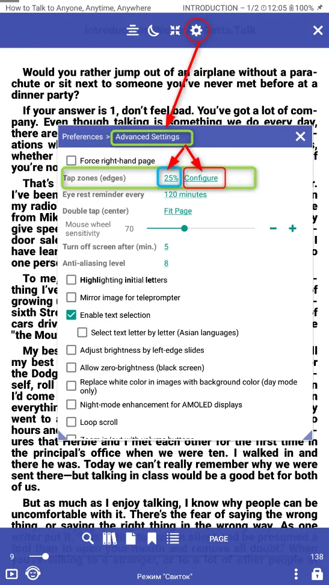
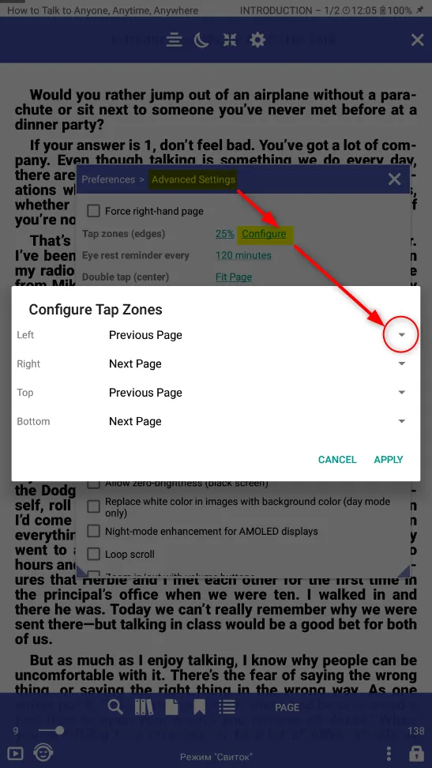
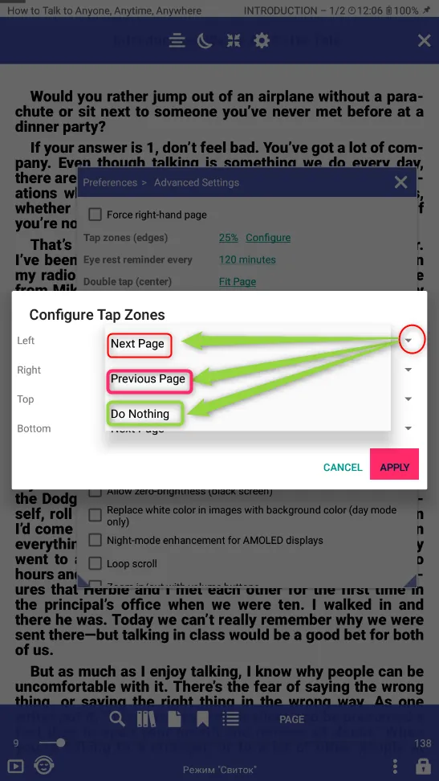
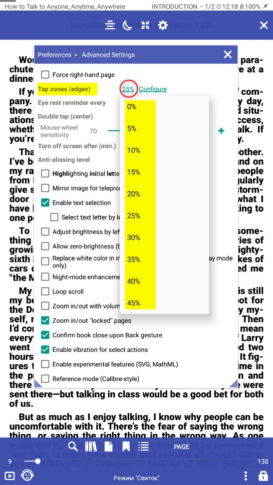

# تكوين حجم مناطق علامات التبويب على اليسار/اليمين/أعلى/أسفل

> يمكنك تكوين حجم مناطق علامات التبويب (الحواف) وأماكنها:

||||
|-|-|-|
||

لتهيئة الإجراءات عند النقر فوق منطقة علامة التبويب (منطقة الرسائل النصية) ، تحتاج إلى فتح **الإعدادات** ،
ثم انتقل إلى **الوظائف المتقدمة** ، وابحث عن القسم **مناطق علامات التبويب (مناطق الرسائل النصية)** وانقر على **إعداد**.

في النافذة المنبثقة المقابلة لمنطقة علامة التبويب المطلوبة ، انقر فوق المثلث وحدد الإجراء المطلوب.

بعد التثبيت ، لا تنس الضغط على **تطبيق**

||||
|-|-|-|
|||

لتكوين جهاز توجيه مناطق علامات التبويب (مناطق الرسائل النصية) ، تحتاج إلى فتح **الإعدادات**.

ثم انتقل إلى **الوظائف المتقدمة** ، وابحث عن القسم **مناطق علامات التبويب (مناطق الرسائل النصية)** وحدد موجه منطقة علامات التبويب

||||
|-|-|-|
|||
