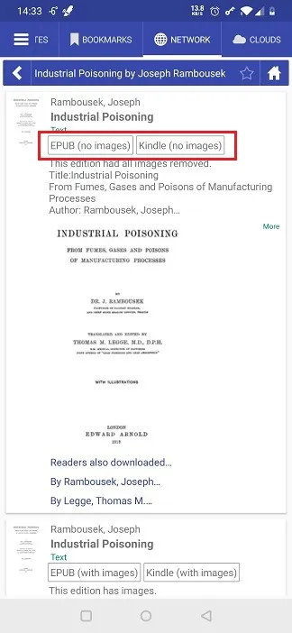
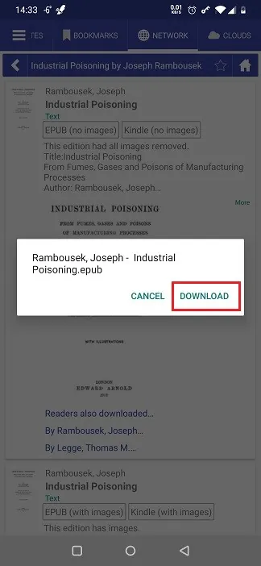
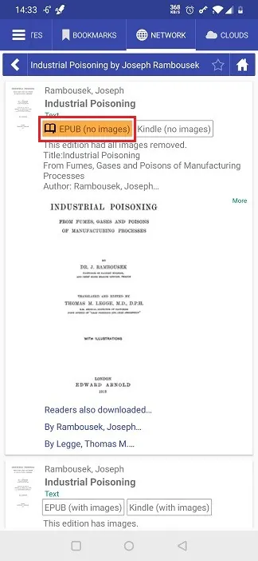
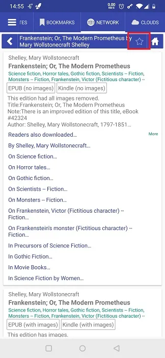
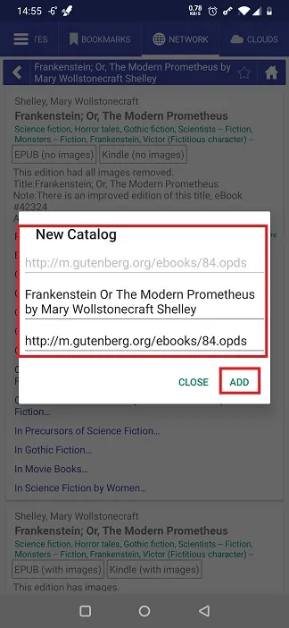
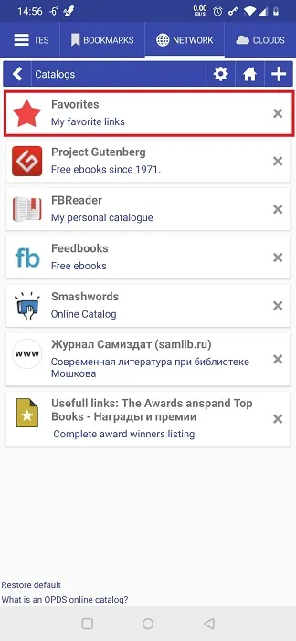
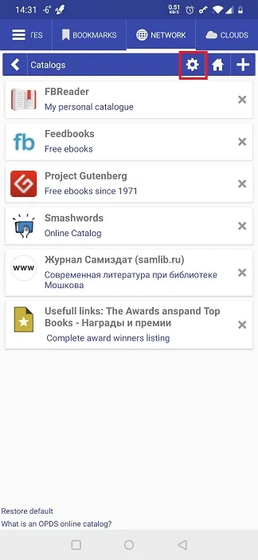
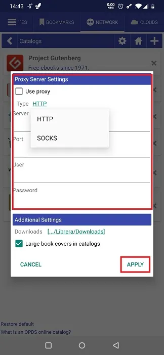
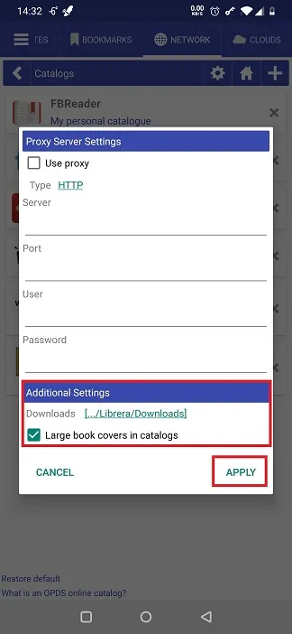

# Working with OPDS Catalogs

> The Open Publication Distribution System (OPDS) format is a syndication format for electronic publications. OPDS catalogs enable the aggregation, distribution, discovery, and acquisition of electronic publications (Wikipedia).

**Librera** allows the user to open OPDS catalogs, use their search engines to navigate within them, and download books from them.

## Opening a Catalog
* **Librera** comes with a preconfigured list of catalogs in the _Networks_ tab
* Tap on a list item to open a catalog (some of them require registration, so make sure you've already registered with those)

## Adding a Catalog to the List
* Tap the add icon (**+**) to open the _New Catalog_ dialog
* Enter the address of the catalog and its name and description (optional), and then tap _ADD_
> **Librera** will open this dialog again if the connection fails. Check _Add as a WEB site_ box and try again

**To remove all OPDS catalogs you've added to the original list, tap the _Restore default_ link at the bottom**

||||
|-|-|-|
||||

||||
|-|-|-|
||||

## Downloading a Book from an OPDS Catalog
* Navigate to the book you intend to download
* Select the desired book format by tapping on it
* Confirm the download
* The entry of the book you've just downloaded will be highlighted
* Open the book and enjoy

||||
|-|-|-|
||||

## Adding Directories in OPDS Catalogs to Favorites
* Navigate to your favorite directory in an OPDS catalog
* Tap on the star (favorites) icon
* Make meaningful changes to the name
* Confirm addition to the list by tapping _ADD_ 
* The directory will appear on the Catalogs list

||||
|-|-|-|
||||

## Changing the Settings
* Tap on the settings icon
* You can route connection to OPDS catalogs via a proxy server specified in the _Proxy Server Settings_ panel of the settings window
* You can change the folder for your downloads from OPDS catalogs
* If you prefer seeing large book covers while browsing the catalogs, check the respective box

||||
|-|-|-|
||||
