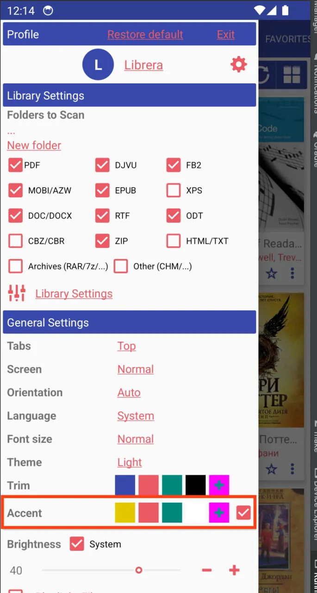
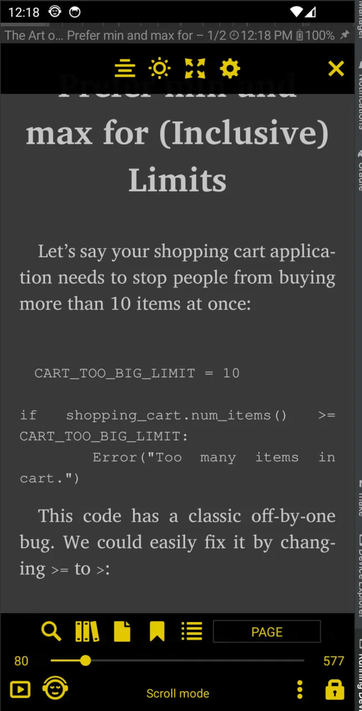
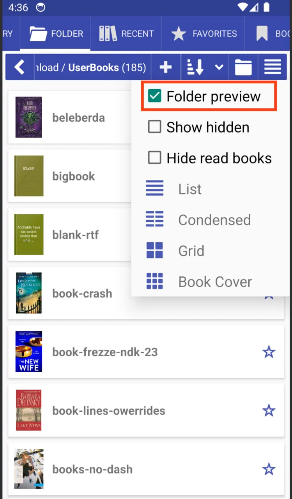

# Novedades

### [8.9.54] Color de acento

||||

### [8.9.50] Vista previa de carpeta


### [8.8.104] Resaltar letras iniciales

### [8.8.79] Buscar algún texto en los libros de la Biblioteca

* Es posible filtrar los resultados de la biblioteca
* La búsqueda de oraciones es posible

### [8.8.79] Ordenar marcadores por página o por fecha
### [8.8.37] Acceder a la Biblioteca desde el libro
### [8.8.16] Admite imágenes externas (http://) en libros EPUB.

La característica experimental debe estar habilitada

### [8.8.0] Cambiar el motor de renderizado dentro de la aplicación

**MuPDF_1.11** motor básico de renderizado de Librera

**MuPDF_1.20.x** motor de renderizado moderno, rápido, preciso, pero puede tener errores y bloqueos

### [8.6.44] Rotar página en el menú inferior
### [8.6.47] Compatibilidad con CSS personalizado y compatibilidad con tablas
Se agregó la posibilidad de elegir el archivo css de estilos de usuario
```
/sdcard/Librera/profile.Librera/device.[]/*.css

app-Librera.css - Librera default user styles for documents
app-MuPDF.css - Default MUPDF styles with Table support
```

### [8.6.44] Rotar página en el menú inferior
### [8.6.43] Gira la página 90 grados, corta los bordes blancos, corta en dos páginas

### [8.6.41] Mostrar nombre de serie, ordenar por índice de serie
### [8.6.40] Configurar qué mostrar en la pestaña de favoritos
### [8.6.39] Se movieron la búsqueda web y los diccionarios web a los archivos de usuario app-WebDict.json y app-WebSearch.json

```
> /storage/emulated/0/Librera/profile.Librera/device.[name]/app-WebSearch.json
[
{"name": "_ Disabled dict starts with _", "path": "https://translate.google.com/#%s/%s/%s"},
{"name": "Google", "path": "http://www.google.com/search?q=%s"},
{"name": "StartPage", "path": "https://www.startpage.com/sp/search?query=%s"},
{"name": "DuckDuckGo", "path": "https://duckduckgo.com/?q=%s"}
]
```

### [8.6.36] Agregar búsqueda web en Google, DuckDuckGo, StartPage
### [8.6.32] Pestaña Favoritos: lista de opciones de clasificación
### [8.6.30] Librera Old para Android 4.0+ [Descargar](https://github.com/foobnix/LibreraReader/releases/)
### [8.6.21] Crear una carpeta con el nombre del libro para los libros descargados de OPDS
### [8.6.19] Factor de escala de imagen personalizada (escala gráfica) para Epub

### [8.6.01] Nuevos iconos vectoriales, interfaz de usuario mejorada
### [8.5.50] Mostrar número de libros en cada carpeta
### [8.5.40] Ocultar libros leídos en la pestaña Carpeta y la pestaña Biblioteca
### [8.5.27] Restaurar consulta de búsqueda al inicio

### [8.5.12] Admite EPUB y cómics con imágenes WEBP
### [8.4.21] Codificación de texto predeterminada para archivos .TXT
### [8.4.08] Abrir siempre los libros en modo de 2 páginas

### [8.3.97] Habilitar deshabilitar la integración del menú contextual (selección de texto)

### [8.3.94] Vincula un GitBook

### [8.3.90] Optimización de accesibilidad

### [8.3.84] Formato de carpeta de descarga OPDS &quot;[Nombre del autor]/Nombre del libro&quot;

### [8.3.80] Selección de texto: la última palabra con guión en la página se seleccionará como completa

### [8.3.78] Idioma de guión predeterminado para todos los libros

### [8.3.77] Imagen especular para telepromter

### [8.3.70] Mostrar descripción del libro

### [8.3.58] recuento de libros en carpeta

### [8.3.49] &quot;Abrir con&quot; acción predeterminada de libro abierto

### [8.3.41] Pestañas &quot;Solo iconos&quot;

### [8.2.37] Nuevo archivo, Nueva carpeta, Ir a las opciones de carpeta

### [8.2.36] Ruta de edición &quot;Ir a la carpeta&quot; (clic largo)

### [8.2.22] Modo de referencia como en la vista de calibre

### [8.2.21] Soporte básico de archivos .md Markdown

### [8.2.20] Enviar la página como texto/imagen desde el cuadro de diálogo Ir a la página.

### [8.2.19] Especifique formatos de libros para modos de lectura (preajustes de modo de lectura)

